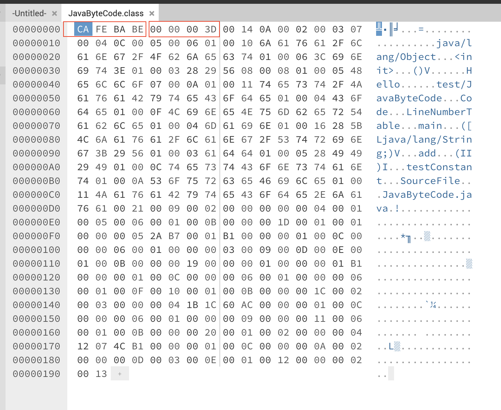
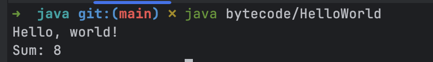

Bytecode là mã trung gian được tạo ra bởi trình biên dịch (compiler), ngôn ngữ nguồn không nhất thiết là Java, nó không phải là mã máy (machine code) được sử dụng bởi JVM thông qua quá trình thông dịch (interpretation), Just-In-Time (JIT), hoặc Ahead-Of-Time (AOT).


## .class file

Trong Java, bytecode được lưu trữ trong các file `.class`, có thể được tạo ra từ mã nguồn Java bằng trình biên dịch thông qua lệnh `javac`.

Ví dụ có một file `JavaByteCode.java` như sau:

```java
public class JavaByteCode {

    public static void main(String[] args) {
    }

    public int add(int a, int b) {
        return a + b;
    }

    void testConstant() {
        String var = "Hello";
    }
}
```

Chạy lệnh `javac JavaByteCode.java` sẽ tạo ra file `JavaByteCode.class`, đây là một file chứa mã hex, nếu đọc bằng hex editor sẽ thấy nội dung như sau:



Tất nhiên đây không phải dạng text có thể đọc được rõ ràng, để xem cấu trúc và nội dung của file này, cần một công cụ giải mã và JDK cung cấp sẵn lệnh `javap` để làm việc này.

Lệnh `javap -c -verbose JavaByteCode.class` cho ra kết quả như sau:

```bash
Classfile /Users/dntam/Projects/java/leetcode/src/main/java/test/JavaByteCode.class
  Last modified Jul 13, 2025; size 402 bytes
  SHA-256 checksum e515c50ccb13397ae81db0bc1cdd28c13299c12fc757e200a0caae6c8c3c0131
  Compiled from "JavaByteCode.java"
public class test.JavaByteCode
  minor version: 0
  major version: 61
  flags: (0x0021) ACC_PUBLIC, ACC_SUPER
  this_class: #9                          // test/JavaByteCode
  super_class: #2                         // java/lang/Object
  interfaces: 0, fields: 0, methods: 4, attributes: 1
Constant pool:
   #1 = Methodref          #2.#3          // java/lang/Object."<init>":()V
   #2 = Class              #4             // java/lang/Object
   #3 = NameAndType        #5:#6          // "<init>":()V
   #4 = Utf8               java/lang/Object
   #5 = Utf8               <init>
   #6 = Utf8               ()V
   #7 = String             #8             // Hello
   #8 = Utf8               Hello
   #9 = Class              #10            // test/JavaByteCode
  #10 = Utf8               test/JavaByteCode
  #11 = Utf8               Code
  #12 = Utf8               LineNumberTable
  #13 = Utf8               main
  #14 = Utf8               ([Ljava/lang/String;)V
  #15 = Utf8               add
  #16 = Utf8               (II)I
  #17 = Utf8               testConstant
  #18 = Utf8               SourceFile
  #19 = Utf8               JavaByteCode.java
{
  public test.JavaByteCode();
    descriptor: ()V
    flags: (0x0001) ACC_PUBLIC
    Code:
      stack=1, locals=1, args_size=1
         0: aload_0
         1: invokespecial #1                  // Method java/lang/Object."<init>":()V
         4: return
      LineNumberTable:
        line 3: 0

  public static void main(java.lang.String[]);
    descriptor: ([Ljava/lang/String;)V
    flags: (0x0009) ACC_PUBLIC, ACC_STATIC
    Code:
      stack=0, locals=1, args_size=1
         0: return
      LineNumberTable:
        line 6: 0

  public int add(int, int);
    descriptor: (II)I
    flags: (0x0001) ACC_PUBLIC
    Code:
      stack=2, locals=3, args_size=3
         0: iload_1
         1: iload_2
         2: iadd
         3: ireturn
      LineNumberTable:
        line 9: 0

  void testConstant();
    descriptor: ()V
    flags: (0x0000)
    Code:
      stack=1, locals=2, args_size=1
         0: ldc           #7                  // String Hello
         2: astore_1
         3: return
      LineNumberTable:
        line 13: 0
        line 14: 3
}
SourceFile: "JavaByteCode.java"
```

## Cấu trúc file .class

[Cấu trúc file `.class`](https://docs.oracle.com/javase/specs/jvms/se8/html/jvms-4.html#jvms-4.4.6) được chia ra các phần chính như sau:

| Phần                 | Mô tả                                                                                                                                     | Tham khảo                                                               |
|----------------------|-------------------------------------------------------------------------------------------------------------------------------------------|-------------------------------------------------------------------------|
| Class file structure | Metadata của class: java version, constant_pool_count, access_flags, tham chiếu index this class, super class, fields_count, method_count | https://docs.oracle.com/javase/specs/jvms/se8/html/jvms-4.html#jvms-4.1 |
| Constant pool        | Bảng lưu trữ các kí hiệu (symbolic) cho class, cụ thể là các hằng số, tham chiếu tên class, interface, method, variable,...               | https://docs.oracle.com/javase/specs/jvms/se8/html/jvms-4.html#jvms-4.4 |
| Fields               | Biểu diễn định nghĩa các biến trong class: tên biến, kiểu dữ liệu, access flag                                                            | https://docs.oracle.com/javase/specs/jvms/se8/html/jvms-4.html#jvms-4.5 |
| Methods              | Biểu diễn định nghĩa các method trong class: tên hàm, tham số, access flag, stack size, code thực thi,...                                                                                                                                            | https://docs.oracle.com/javase/specs/jvms/se8/html/jvms-4.html#jvms-4.6 |

### Descriptor

[Descriptor](https://docs.oracle.com/javase/specs/jvms/se8/html/jvms-4.html#jvms-4.3) là chuỗi kí tự biểu diễn *kiểu* của:
- field: kiểu của class, biến instance, biến cục bộ. Ví dụ biến có kiểu `int` sẽ được biểu diễn là `I`, biến có kiểu `String` sẽ được biểu diễn là `Ljava/lang/String;`.
- method: kiểu của hàm, kiểu tham số, kiểu trả về. Ví dụ hàm main được biểu diễn `([Ljava/lang/String;)V`, trong đó:
  - `[` là mảng, `L` là class (kiểu object), `I` là kiểu int, `V` là kiểu void.
  - `([Ljava/lang/String;)V` có nghĩa là hàm nhận vào một mảng các đối tượng kiểu String và không trả về giá trị gì.

### Tập chỉ dẫn

Lấy trường hợp JVM cần thông dịch bytecode, JVM có thể được xem là bộ xử lý ảo (virtual processor) cho bytecode, để hiện thực điều này, JVM cung cấp tập hợp các chỉ dẫn ([instruction set](https://docs.oracle.com/javase/specs/jvms/se7/html/jvms-6.html)) để thực thi. 

Nhìn vào phần `Code` ở mỗi method của file `.class`, các lệnh như `iload_1`, `iload_2`, `iadd`, `ireturn` là các chỉ dẫn được định nghĩa bởi JVM, với mỗi chỉ dẫn JVM sẽ thực thi một hành động cụ thể.

Nhắc lại JVM là một stack machine, các chỉ dẫn sẽ thao tác với các toán hạng trên stack.

Lấy hàm cộng 2 số để phân tích:

```java
public int add(int a, int b) {
        return a + b;
}
```
Bytecode tương ứng: 

```
  public int add(int, int);
    descriptor: (II)I
    flags: (0x0001) ACC_PUBLIC
    Code:
      stack=2, locals=3, args_size=3
         0: iload_1
         1: iload_2
         2: iadd
         3: ireturn
      LineNumberTable:
        line 13: 0
```

1. `iload_1` và `iload_2` sẽ lấy giá trị của biến `a` và `b` từ stack, đưa vào stack.
    - stack: [a, b] -> 2 phần tử.
2. `iadd` sẽ lấy 2 giá trị trên stack, thực hiện phép cộng và đưa kết quả lên stack.
    - stack: [a + b] -> 1 phần tử.
3. `ireturn` sẽ lấy giá trị trên stack và trả về kết quả.

Trong quá trình thực thi 3 bước ở trên, số lượng phần tử tối đa trên stack là 2, điều đặc biệt là trình biên dịch tính toán được số này dựa trên code và ghi vào metadata của hàm.

Đoạn bytecode ở trên chỉ có những lệnh cơ bản, JVM cung cấp [hơn 200 lệnh](https://docs.oracle.com/javase/specs/jvms/se7/html/jvms-6.html) khác nhau để thực hiện các phép toán, thao tác với stack, điều khiển luồng chương trình, thao tác với mảng, đối tượng, v.v.

## Thao thác bytecode

Một khi nắm được các thông tin về bytecode, có thể sử dụng thư viện [proguard-core](https://github.com/Guardsquare/proguard-core) để thử tạo ra một file class và chạy bằng lệnh `java`.

Thử tạo một [hàm cộng 2 số và in ra kết quả](https://github.com/dntam00/java-notes/blob/6eb0744c87edb4b2c5873fad03ec0af1503bd847/src/main/java/bytecode/JavaByteCodeManipulation.java#L18) <- đường dẫn source code:

```java
package bytecode;

public class HelloWorld {
    public static void main(String[] var0) {
        System.out.println("Hello, world!");
        System.out.println("Sum: " + sum(5, 3));
    }

    public static int sum(int var0, int var1) {
        return var0 + var1;
    }
}
```

Sau khi có file `.class`, có thể sử dụng lệnh `java` để chạy và xem kết quả:



## References

- https://docs.oracle.com/javase/specs/jvms/se7/html/jvms-6.html
- https://docs.oracle.com/javase/specs/jvms/se8/html/jvms-4.html
- https://blogs.oracle.com/javamagazine/post/mastering-the-mechanics-of-java-method-invocation
- https://blogs.oracle.com/javamagazine/category/jm-jvm-internals
