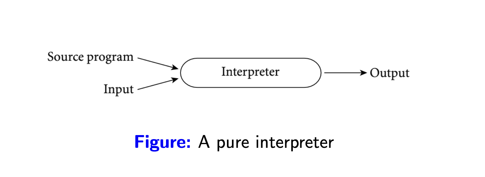
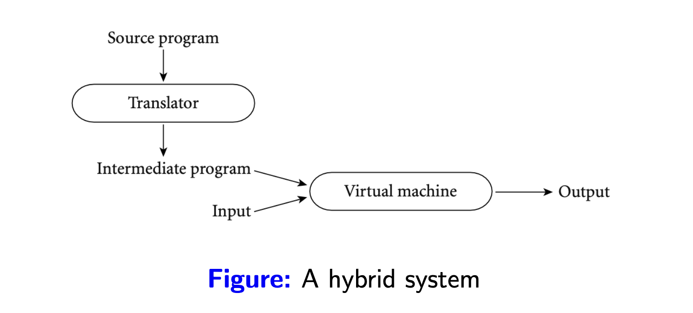
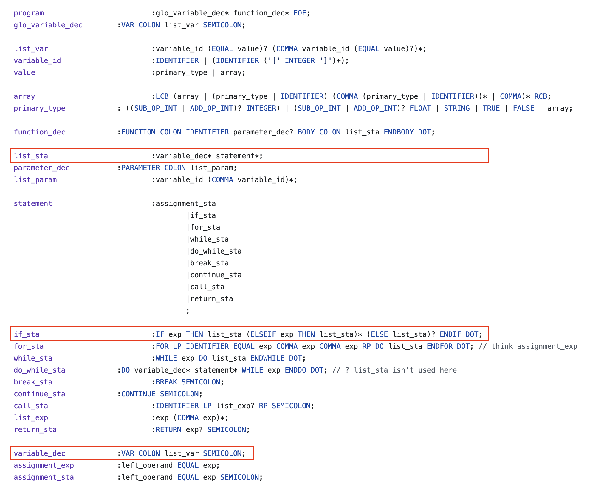
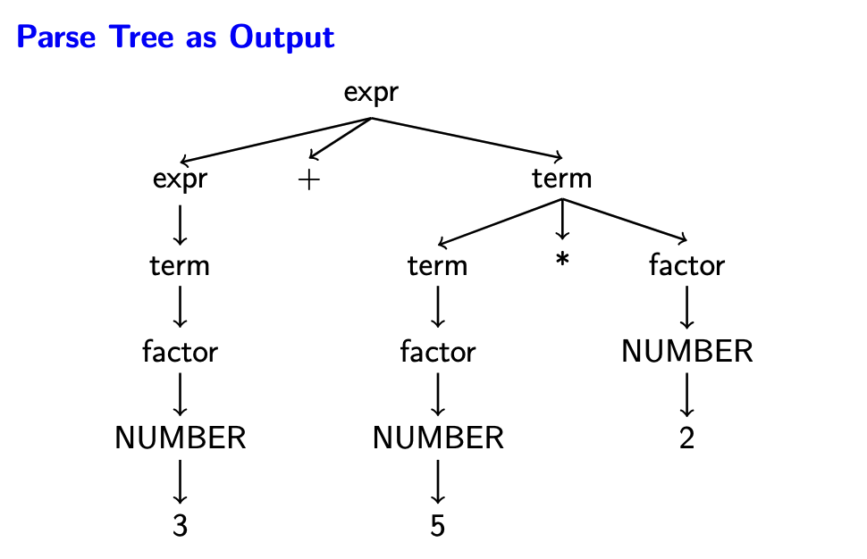
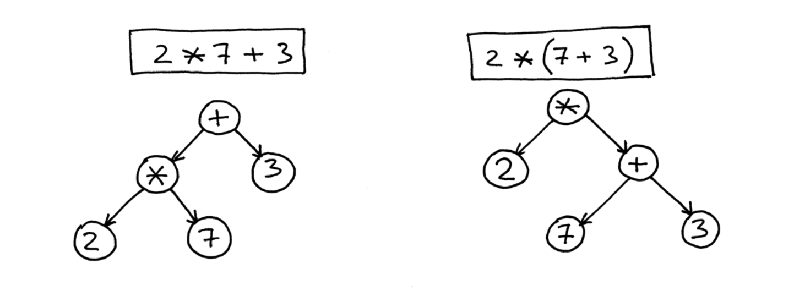

Sử dụng Java nhiều năm rồi nhưng mình chưa có cơ hội tìm hiểu nhiều về `JVM`, nó như một chiếc hộp kín đầy bí ẩn và đáng sợ, như ai đó đã từng nói một trong những lý do mình sợ cái một cái gì đó là do mình chưa hiểu rõ về nó, nên để bớt sợ hơn thì mình bắt đầu công cuộc xoá mù JVM.

Để tìm kiếm những mảnh chìa khoá đầu tiên trong hành trình mở khoá chiếc hộp này (hy vọng mở được :v), mình bắt đầu *lại* với cách một trình biên dịch hoạt động. Nói tìm hiểu lại là vì hồi đại học trường mình có dạy môn `Nguyên lý ngôn ngữ lập trình` nói về cách một ngôn ngữ lập trình (NNLT) hoạt động (môn này giờ nghĩ lại vẫn thấy sợ :3). May mắn là sau nhiều năm mình vẫn còn lưu lại mã nguồn của bài tập lớn nên có gì lấy làm ví dụ trong bài này luôn. :D

<!-- Có bao giờ bạn thắc mắc làm thế nào mà máy tính thực thi một chương trình viết bằng các ngôn ngữ bậc cao như Java, Golang,...? Nếu là lập trình viên, chắc chắn ai cũng biết đại ý là chúng ta sẽ cần các công cụ như trình biên dịch (`compiler`) hay thông dịch (`interpreter`) tuỳ vào ngôn ngữ. -->

Để một chương trình được viết bằng ngôn ngữ bậc cao như Java, Go,... chạy được trên máy tính, nó phải được chuyển sang một dạng mà bộ xử lý có thể hiểu và thực thi. Có nhiều kĩ thuật để làm điều này:
- `Biên dịch (compilation)`: chuyển đổi toàn bộ mã nguồn từ một ngôn ngữ này sang một ngôn ngữ khác. Mã của ngôn ngữ đích không nhất thiết phải là mã máy (`machine code`), tức là nó có thể trở thành đầu vào cho một trình biên dịch hay thông dịch khác. Quá trình này chỉ xảy ra 1 lần, biên dịch xong là ta có mã nguồn của ngôn ngữ đích có thể được sử dụng nhiều lần. Lấy ví dụ một người dịch giả có thể dịch sách 1 lần, sau đó người đọc có thể đọc bản dịch nhiều lần mà không cần làm phiền với dịch giả nữa :v.


- `Thuần thông dịch (pure interpretation)`: đọc và thực thi trực tiếp từng dòng của mã nguồn. Với cách làm này trình thông dịch sẽ cần lặp lại công việc nếu một đoạn code được gọi nhiều lần. Điều thú vị ở cách mà trình thông dịch thực thi từng dòng mã nguồn, trình thông dịch giống như một trình giả lập máy (`machine emulator`), chứa một tập hợp các quy trình/chỉ dẫn được chuẩn bị sẵn để thực thi mã nguồn, nhìn một cách tổng quát hơn thì nó giống như bộ xử lý ảo cho phần mềm vậy. Lấy ví dụ với một người phiên dịch viên trong một cuộc họp, họ phải dịch từng câu của mỗi bên tham gia, và cho dùng các câu này có bị lặp lại thì họ vẫn phải dịch.



- `Kết hợp biên dịch và phiên dịch (hybrid)`: kết hợp cả 2 trình thông dịch và biên dịch, trình biên dịch làm giai đoạn đầu tiên, biên dịch ra ngôn ngữ trung gian, sau đó trình thông dịch thực thi ngôn ngữ trung gian này. Có nhiều lý do để làm điều này, ngôn ngữ trung gian giúp tách biệt sự phụ thuộc vào cấu trúc bộ xử lý, hỗ trợ thiết kế thêm các thành phần đi kèm để tối ưu việc thự thi ngôn ngữ trung gian, quản lý bộ nhớ,...



- `Biên dịch đúng lúc (just-in-time compiler)`: ở phần trình thông dịch mình có đề cập đến một điểm yếu đó là có nhiều đoạn code sẽ được thực thi lại khi được gọi nhiều lần, `JIT` tối ưu phần này bằng cách tìm những đoạn code được thực thi nhiều lần, thuật ngữ gọi là `hot code` và biên dịch ra mã máy.


Giới thiệu qua các kĩ thuật biên/thông dịch vậy đủ rồi, vào chủ đề chính thôi, bài này mình sẽ đi tìm hiểu *lại* tổng quan các bước mà một ***trình biên dịch*** cần làm khi xử lý mã nguồn, nói tìm hiểu lại là vì hồi đại học trường mình có dạy môn `Nguyên lý ngôn ngữ lập trình` trình bày về cách một ngôn ngữ lập trình (`NNLT`) hoạt động (môn này giờ nghĩ lại vẫn thấy sợ :3). May mắn là sau nhiều năm mình vẫn còn lưu lại mã nguồn của bài tập lớn nên có gì lấy làm ví dụ trong bài này luôn. :D

## Trình biên dịch

Để thực thi được các câu lệnh trên cpu, bằng cách này hay cách khác, tất cả những gì lập trình viên viết ra phải được chuyển thành thứ mà cpu có thể hiểu và xử lý được. Quá trình này khi sử dụng trình biên dịch thì được biểu diễn như hình sau:


### Phân tích từ vựng (Lexical analysis)

Lấy ví dụ về việc giao tiếp giữa con người, những gì chúng ta nói ra cần có ý nghĩa thì người đối diện mới hiểu được, chúng được cấu thành từ các bộ từ vựng đã được tạo ra, duy trì và phát triển. Đối với NNLT cũng vậy, đội ngũ phát triển ngôn ngữ phải định nghĩa được các từ nào có ý nghĩa đối với NNTL của họ, từ nào không, ví dụ cùng một ý nghĩa `rỗng` nhưng Golang và Java sử dụng các từ khoá khác nhau, lần lượt là `nil` và `null`.

Quá trình tìm ra các từ khoá có ý nghĩa từ mã nguồn để xử lý được gọi là phân tích từ vựng. Công cụ phân tích từ vựng sẽ đọc mã nguồn và lấy ra các từ khoá cần thiết dựa trên bộ quy tắc được thiết lập sẵn. Quá trình này có thể cho ra output như:
- Tên hàm, tên biến,...
- Từ khoá của ngôn ngữ.
- Toán tử.

được gọi chung là `tokens`.

Một công cụ mình đã sử dụng trong lúc làm bài tập lớn ở đại học là [ANTLR](https://github.com/antlr/antlr4), mọi người có thể tham khảo thêm.


### Phân tích ngữ pháp (Syntax analysis)

Bước tiếp theo trong việc xử lý mã nguồn là phân tích ngữ pháp.

Từ kết quả của bước phân tích từ vựng, bộ phân tích ngữ pháp sẽ kiểm tra xem lập trình viên có sử dụng các từ khoá đúng với ngữ pháp đã được quy định hay không. Ví dụ ngữ pháp tiếng Việt có cấu trúc chủ ngữ pháp chủ ngữ rồi đến động từ, thì các NNLT cũng có các quy định của nó, về bản chất đó là sự thống nhất để 2 bên có thể hiểu được nhau.

Ví dụ với Java, khi viết câu điều kiện, chúng ta cần một cặp dấu ngoặc tròn `()` để chứa điều kiện, nếu bạn quên chúng, trình biên dịch sẽ báo lỗi cú pháp.

Hình dưới một ví dụ về [bài tập lớn của mình](https://github.com/dntam00/principles-programming-language/blob/master/assignment-1/src/main/bkit/parser/BKIT.g4) để mọi người có thể hình dung được các quy tắc này được định nghĩa ra sao, ở ngôn ngữ này thì sau `if` không cần dấu ngoặc :v.



Bộ phân tích ngữ pháp áp dụng quy tắc sản xuất (`production rule` trong `Context-Free Grammar`) để bắt đầu xây dựng cây cú pháp với quy tắc tổng quát:

```bash
A → α
```

1. A là ký hiệu không kết thúc (`non-terminal`).
2. α là một chuỗi gồm ký hiệu kết thúc (`terminal`) và không kết thúc.

Tất nhiên gọi là không kết thúc vì ta có thể phân giải ký hiệu này thành một tập các ký hiệu khác. Lấy ví dụ mình đưa ở trên, nếu bạn nhìn vào quy tắc cho câu lệnh `if`, sau từ khoá `THEN` là `list_sta`, áp dụng quy tắc sản xuất, nó có thể được thay thế bằng `varaible_dec* statement*`, hiểu là các khai báo biến, các câu lệch, và vì chúng là ký hiệu không kết thúc, ta sẽ cần phân giải tiếp,...

Sử dụng quy tắc mình vừa giới thiệu và tập tokens từ bước phân tích từ vựng, bộ phân tích ngữ pháp sẽ thực hiện kiểm tra ngữ pháp, kết quả của quá trình này là một cây ngữ pháp được sử dụng cho các bước tiếp theo. Nếu có lỗi trong quá trình tạo cây, lỗi sẽ được trả về, lập trình viên có thể dựa vào lỗi để sửa mã nguồn của mình.

Hình sau minh hoạ parse-tree cho biểu thức `3 + 5 ∗ 2`.



### Tạo cây cú pháp trừu tượng (Abstract syntax tree generation)

Cây cú pháp trừu tượng (`Abstract syntax tree - AST`) về cơ bản cũng biểu diễn cấu trúc cú pháp của mã nguồn, nhưng ở mức trừu tượng hơn cây cú pháp chi tiết.

1. Cây phân cấp: có node gốc và các node con, mỗi node biển diễn một cấu trúc cụ thể của mã nguồn, ví dụ khai báo biến, câu lệnh lặp, điều kiện, biểu thức toán học,...
2. Mức độ trừu trượng: loại bỏ đi các chi tiết ngữ pháp như dấu chấm phẩy, dấu ngoặc,... tập trung vào biểu diễn cấu trúc cơ bản và ngữ nghĩa của chương trình. Ví dụ như thay vì dùng cặp dấu ngoặc đơn để thể hiện sự ưu tiên trong các biểu thức toán học, AST sử dụng mối quan hệ giữa các node để biểu diễn.



Trong thực tế, để tạo AST, chúng ta cần định nghĩa các [cấu trúc dữ liệu](https://github.com/dntam00/principles-programming-language/blob/master/assignment-3/src/main/bkit/utils/AST.py) để biểu diễn các cấu trúc của 1 NNLT, đoạn code sau biểu diễn 1 class để lưu trữ thông tin cho một biểu thức 2 ngôi.

1. Toán tử.
2. Toán hạng trái.
3. Toán hạng phải.

```python
@dataclass
class BinaryOp(Expr):
    op:str
    left:Expr
    right:Expr

    def __str__(self):
        return "BinaryOp(" + self.op + "," + str(self.left) + "," + str(self.right) + ")"

    def accept(self, v, param):
        return v.visitBinaryOp(self, param)
```

Để tạo AST, các công cụ hiện tại thường sử dụng [visitor pattern](https://en.wikipedia.org/wiki/Visitor_pattern) để duyệt qua các node của cây cú pháp, tại mỗi node sẽ có nghiệp vụ cụ thể để xử lý và trả về cấu trúc biểu diễn trong AST.

Đoạn code sau minh hoạ logic khi duyệt qua một node biểu diễn biểu thức (bạn có thể xem chi tiết định nghĩa ngôn ngữ lập trình của bài tập lớn mình của mình ở [BKIT](https://github.com/dntam00/principles-programming-language/blob/master/BKIT2009%20Specification-2.2.pdf))

```python
    def visitExp(self, ctx: BKITParser.ExpContext):
        if ctx.EQUAL_OP_INT():
            return BinaryOp(ctx.EQUAL_OP_INT().getText(), ctx.exp1(0).accept(self), ctx.exp1(1).accept(self))
        elif ctx.NOT_EQUAL_OP_INT():
            return BinaryOp(ctx.NOT_EQUAL_OP_INT().getText(), ctx.exp1(0).accept(self), ctx.exp1(1).accept(self))
        elif ctx.LESS_OP_INT():
            return BinaryOp(ctx.LESS_OP_INT().getText(), ctx.exp1(0).accept(self), ctx.exp1(1).accept(self))
        elif ctx.GREATER_OP_INT():
            return BinaryOp(ctx.GREATER_OP_INT().getText(), ctx.exp1(0).accept(self), ctx.exp1(1).accept(self))
        elif ctx.LESS_EQUAL_OP_INT():
            return BinaryOp(ctx.LESS_EQUAL_OP_INT().getText(), ctx.exp1(0).accept(self), ctx.exp1(1).accept(self))
        elif ctx.GREATER_EQUAL_OP_INT():
            return BinaryOp(ctx.GREATER_EQUAL_OP_INT().getText(), ctx.exp1(0).accept(self), ctx.exp1(1).accept(self))
        elif ctx.NOT_EQUAL_OP_FLOAT():
            return BinaryOp(ctx.NOT_EQUAL_OP_FLOAT().getText(), ctx.exp1(0).accept(self), ctx.exp1(1).accept(self))
        elif ctx.LESS_OP_FLOAT():
            return BinaryOp(ctx.LESS_OP_FLOAT().getText(), ctx.exp1(0).accept(self), ctx.exp1(1).accept(self))
        elif ctx.GREATER_OP_FLOAT():
            return BinaryOp(ctx.GREATER_OP_FLOAT().getText(), ctx.exp1(0).accept(self), ctx.exp1(1).accept(self))
        elif ctx.LESS_EQUAL_OP_FLOAT():
            return BinaryOp(ctx.LESS_EQUAL_OP_FLOAT().getText(), ctx.exp1(0).accept(self), ctx.exp1(1).accept(self))
        elif ctx.GREATER_EQUAL_OP_FLOAT():
            return BinaryOp(ctx.GREATER_EQUAL_OP_FLOAT().getText(), ctx.exp1(0).accept(self), ctx.exp1(1).accept(self))
        else:
            return ctx.exp1(0).accept(self)
```

Cây AST đóng một vai trò quan trọng trong lập trình, với đặc điểm biểu diễn cấu trúc ngữ nghĩa của mã nguồn, chúng ta có thể sử dụng AST trong các việc sau:
1. Phân tích ngữ nghĩa của ngôn ngữ (`semantic analysis`): ví dụ khai báo sai kiểu dữ liệu, tái khai báo lại biến trong 1 phạm vi,... đây là những kiểm tra phức tạp hơn kiểm tra ngữ pháp. 
2. Sinh code (`code generation`): AST được sử dụng để sinh ra mã nguồn đích, ví dụ bytecode.
3. Tái cấu trúc code: gợi ý các cách code tốt hơn, được sử dụng bởi các IDE.


### Intermediate code generation

Đây là một bước có thể có hoặc không, tuỳ vào thiết kế của ngôn ngữ. 

Dựa vào cây AST, trình biên dịch sinh ra mã trung gian, đây là một loại mã nguồn có level thấp hơn các ngôn ngữ bậc cao như Java, Go. 

Mã trung gian như một chiếc cầu nối giữa mã nguồn của ngôn ngữ bậc cao và mã máy, loại mã không phụ thuộc vào cấu trúc vật lý của bộ xử lý (`machine-independent`). Thông thường với kiểu thiết kế này thì sẽ mang lại lợi ích là tách biệt sự phụ thuộc của ngôn ngữ bậc cao và máy tính vật lý, mọi người chắc hẳn cũng nghe đến câu marketing nổi tiếng của Java: `write once run anywhere`.

Lấy Java làm ví dụ để phân tích thêm, trình biên dịch tạo ra bytecode từ các file mã nguồn Java thông thường, JVM sẽ như một trình thông dịch (có cả `JIT`), thực thi từng dòng bytecode này xuống bộ xử lý, vậy chúng ta cũng có thể coi JVM như một bộ **xử lý ảo** cho bytecode.

Minh hoạ bytecode cho một hàm đơn giản trong Java: 

```java
public void load() {
    int x = 5;
}
```

Sau khi biên dịch hàm này bằng lệnh `javac`, được một file `.class`, mình cần decode file này bằng lệnh `javap`.

```
public void load();
    descriptor: ()V
    flags: (0x0001) ACC_PUBLIC
    Code:
      stack=1, locals=2, args_size=1
         0: iconst_5
         1: istore_1
         2: return
      LineNumberTable:
        line 16: 0
        line 17: 2
```

JVM cung cấp một tập các chỉ dẫn để có thể thực thi bytecode, nó là một `stack machine`, tức là để thực thi các câu lệnh, nó thực hiện các thao tác push, pop với stack, nhắc lại stack là cấu trúc dữ liệu với cơ chế LIFO, vào trước ra sau, nên mặc định các thao tác push hay pop sẽ làm việc với phần tử ở đỉnh của stack.

Minh hoạ với đoạn bytecode ở trên, để gán số 5 cho biến x, các bước cần làm là:
1. `iconst_5` -> push 5 vào stack.
2. `istore_1` -> pop phần tử từ stack ra, lưu vào biến x (index của biến x trong hàm này là 1, `this` sẽ có index là 0).

### Tổng kết

Trong bài này, mình bắt đầu với những thứ cở bản nhất của lập trình, biên dịch, thông dịch và làm rõ một số giai đoạn mà một trình biên dịch xử lý mã nguồn.

Kiến thức nền tảng là thứ cần thiết để đi được con đường dài, mình nghĩ vậy.

Lúc tìm hiểu lại những kiến thức này đối với bản thân vẫn còn nhiều chỗ mơ hồ, hy vọng đi tiếp chuỗi bài viết nãy sẽ có thêm cơ sở để củng cố kiến thức cũng như giải thích các thuật ngữ, khái niệm một cách rõ ràng, rành mạch hơn. 

Viết cho người mà thực ra là viết cho mình.

## Tham khảo
1. Slides môn học Nguyên lý ngôn ngữ lập trình ở trường Đại học Bách khoa Tp.Hồ Chí Minh.
2. https://medium.com/@saikadali/building-your-own-jvm-interpreter-from-scratch-86a085e225b1
3. https://medium.com/@davewritescode/lets-have-fun-with-interpreters-and-bytecode-vms-chapter-3-f2392de2e269
4. https://www.quora.com/What-is-the-difference-between-a-compiler-and-an-interpreter/answers/7670223
5. https://www.cse.iitm.ac.in/~manas/docs/cs6843-hotspot.pdf
6. https://albertnetymk.github.io/2021/08/03/template_interpreter
7. https://github.com/cloudsec/ajvm