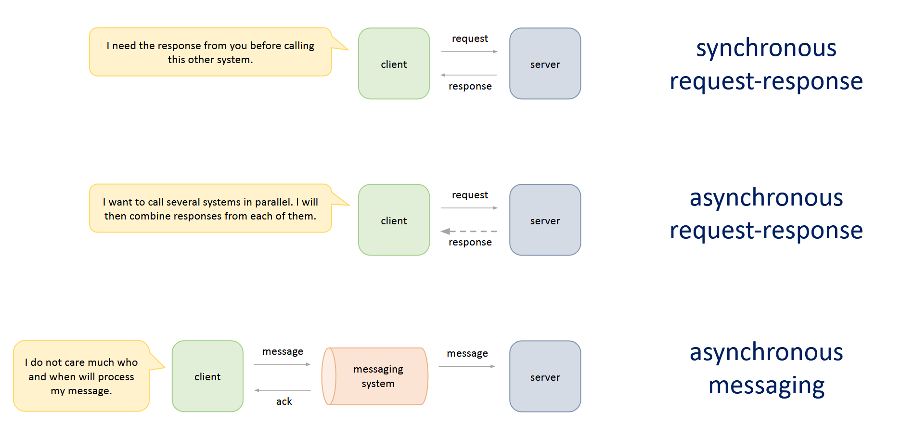

Nhiều năm qua trong quá trình làm nghề lập trình, có những từ khoá mà cho dù có tìm kiếm, đọc rồi suy nghĩ bao nhiêu lần, mình vẫn thấy không thực sự hiểu rõ nó ở lần gặp lại tiếp theo. Vậy nên lần này mình tạo một bài viết để gom những cái này lại, tiện có chỗ để tra cứu.

## Synchronous / Asynchronous / Blocking  / Non blocking

Một trong những từ khoá gây mơ hồ nhất đối với mình, sau khi tra cứu nhiều nguồn, mình đồng ý với cách hiểu hai cặp từ khoá này theo những mục đích sử dụng khác nhau.

- `Synchronous/Asynchronous`: khi tôi cần bạn làm một công việc, khi nào tôi có thể nhận được kết quả? `tôi và bạn` ở đây có thể được biểu diễn ở nhiều mức độ khác nhau: thread gọi hàm trong code, service A gọi service B, frontend gọi backend. 
- `Blocking/Non blocking`: hành vi của tài nguyên tính toán khi công việc đang được thực hiện, để dễ phân biệt thì mình tự giới hạn trong ngữ cảnh thread/process của hệ điều hành, vì cơ bản nó là thứ tiêu biểu nhất, và khi ở trong giới hạn này thì nó sẽ đi kèm từ `I/O` vào.

### Synchronous / Asynchronous

Khi gọi *bạn* để thực hiện một công việc:

- Synchronous: tôi cần chờ kết quả từ *bạn* để có thể làm việc khác.
- Asynchronous: tôi không cần chờ kết quả từ *bạn* mà có thể chuyển qua làm việc khác luôn, rồi lấy kết quả sau đó.

***Với mình thì đây là một vấn đề thuộc về việc thiết kế kiến trúc hệ thống.***

(Ảnh được lấy từ khoá học `System Design for Interviews and Beyond` của bác `Mikhail Smarshchok`)

#### Synchronous

- Ở mức code: gọi tác dụng database, đợi lấy kết quả rồi mới xử lý việc khác.
- Ở mức service: gọi API, đợi lấy kết quả rồi mới xử lý việc khác.

#### Asynchronous

- Ở mức code:
	- Dùng callback, Future, CompletableFuture (Java), async/await (JS, C#, Python) hoặc thread pool + queue.
- Ở mức service:
	- request-response: bên nhận có thể nhận request, phản hồi tôi đã nhận request rồi, tôi sẽ xử lý sau.
		- một số cơ chế bên gửi nhận response: định kì gửi request để kiểm tra kết quả, bên nhận gửi event theo dạng push về (websocket/SEE), hoặc webhook.
	- messaging: bên gửi gửi message đến một hệ thống queue, bên nhận lắng nghe vào queue và tiêu thụ message.
		- một số cơ chế bên gửi nhận response: bên gửi lắng nghe vào queue vào nhận response.

### Blocking / Non blocking

Khi một thread/process cần thực hiện tác vụ I/O, trong lúc đợi kết quả, nó có một vài sự lựa chọn:
- vào trạng thái đợi, không làm gì cả, có nghĩa là bị blocked.
- lấy task khác để thực hiện.
- định kì kiểm tra kết quả, không bị blocked lắm nhưng cũng hơi vô nghĩa.

### Sự kết hợp

Cơ bản thì chúng ta có thể kết hợp các khái niệm trên để cho ra các mô hình sau:

- `Synchronous + Blocking`: mặc định và phổ biến, khi một thread truy vấn database, nó cần đợi kết quả, trong khi đợi thì nó cũng bị blocked, không làm được gì khác.
	- Ví dụ: Tomcat webserver ở cấu hình mặc định.
- `Asynchronous + Blocking`: bạn để thread khác task, bạn không quan tâm task đó xong hay không, bạn đi làm việc khác, nhưng khi thread làm việc đó thì nó cũng sẽ bị blocked.
- `Synchronous + Non-blocking`: ít phổ biến hơn, bạn cần kết quả để làm việc khác, thread không bị blocked, tuy nhiên nó cũng phải truy vấn liên tục để lấy kết quả I/O.
- `Asynchronous + Non-blocking`: bạn để thread làm task, khi thread làm task thì cũng không bị blocked, khi nào có kết quả thì nó lấy kết quả rồi thực thi tiếp (callback) (ở chỗ này mình chưa đề cập đến I/O của hệ điều hành).
	- Ví dụ: Project reactor, NodeJS event loop.