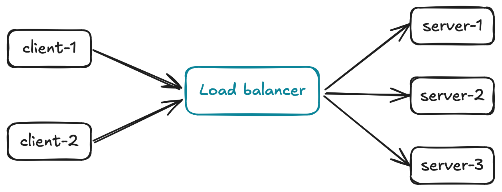
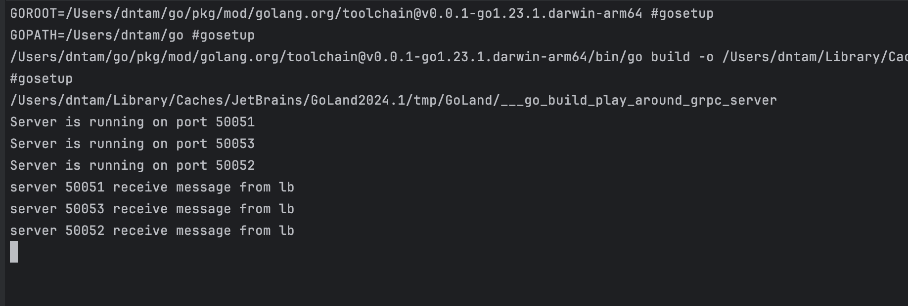
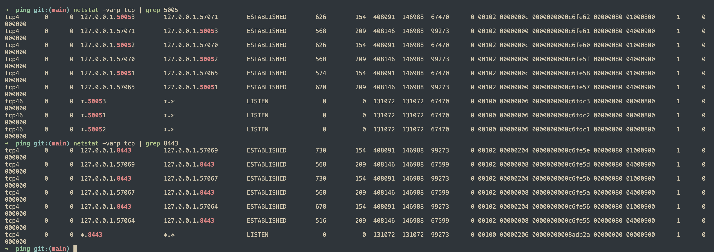

## Proxy load balancing

Đây là một phương pháp truyền thống và dễ cài đặt nhất, chúng ta cần một load balancer đứng giữa client và server, có nhiều ứng viên có thể làm được việc này một cách hiệu quả, ví dụ:
- HAProxy
- Nginx
- LB của các cloud provider



Client sẽ tạo connection tới load balancer và load balancer sẽ tạo connection tới server dựa trên cơ chế load balancing được thiết lập, với cách hoạt động này, chúng ta cần thiết lập 2 connection để có được 1 ***client-server connection***, đó đó, client thực chất đang giao tiếp với load balancer, ở phía LB, chúng ta sẽ có thêm một vài chức năng khác việc load balancing như NAT, đó là LB có thể chọn giữ hoặc ghi đè địa chỉ IP của client,...

**Ưu điểm**
- Dễ cài đặt và sử dụng
- Không phụ thuộc vào ngôn ngữ lập trình khi hiện thực client/server
- Tăng tính an toàn cho server
- Có thể scale bằng cách thêm nhiều instance của load balancer

**Nhược điểm**
- Nếu không quản lý tốt, load balancer có thể là điểm gây lỗi duy nhất (single point of failure)
- Tăng latency của request

## Ví dụ

Mình sẽ sử dụng HAProxy để làm ví dụ cho phương pháp này. Thông tin như sau:
- 3 gRPC server chạy ở port 50051, 50052, 50053
- HAProxy listen ở port 8443
- 2 gRPC client thực hiện request đến HAProxy

**Cấu hình của HaProxy**
```bash
global
  tune.ssl.default-dh-param 1024

defaults
  timeout connect 10000ms
  timeout client 60000ms
  timeout server 60000ms

frontend lb_grpc
  mode tcp
  bind *:8443 npn spdy/2 alpn h2
  default_backend be_grpc

# gRPC servers running on port 8083-8084
backend be_grpc
  mode tcp
  balance roundrobin
  option httpchk HEAD / HTTP/2
  server srv01 127.0.0.1:50051
  server srv02 127.0.0.1:50052
  server srv03 127.0.0.1:50053
```

**Server code**
```go
type server struct {
	serverId string
	pb.UnimplementedDemoServiceServer
}

func (s *server) SayHello(ctx context.Context, req *pb.HelloRequest) (*pb.HelloResponse, error) {
	fmt.Printf("server %v receive message from lb\n", s.serverId)
	return &pb.HelloResponse{Message: "Hello " + req.Name}, nil
}

func main() {
	go serve("50051")
	go serve("50052")
	go serve("50053")
	ctx, stop := signal.NotifyContext(context.Background(), syscall.SIGINT, syscall.SIGTERM)
	defer stop()
	<-ctx.Done()
}

func serve(port string) {
	lis, err := net.Listen("tcp", ":"+port)
	if err != nil {
		log.Fatalf("failed to listen: %v", err)
	}
	s := grpc.NewServer()
	pb.RegisterDemoServiceServer(s, &server{serverId: port})

	fmt.Println("Server is running on port " + port)
	if err := s.Serve(lis); err != nil {
		log.Fatalf("failed to serve: %v", err)
	}
}
```

**Client code**
```go
func main() {
	for i := 0; i < 3; i++ {
		go request()
	}
	ctx, stop := signal.NotifyContext(context.Background(), syscall.SIGINT, syscall.SIGTERM)
	defer stop()
	<-ctx.Done()
}

func request() {
	conn, err := grpc.NewClient("localhost:8443", grpc.WithTransportCredentials(insecure.NewCredentials()))
	if err != nil {
		log.Fatalf("did not connect: %v", err)
	}
	defer func() {
		_ = conn.Close()
	}()

	c := pb.NewDemoServiceClient(conn)

	ctx, cancel := context.WithTimeout(context.Background(), 20*time.Second)
	defer cancel()

	_, err = c.SayHello(ctx, &pb.HelloRequest{Name: "world"})
	if err != nil {
		log.Fatalf("could not greet: %v", err)
	}
}
```

**Service proto**
```
syntax = "proto3";

package dnt;

option go_package = "/model";

service DemoService {
  rpc SayHello (HelloRequest) returns (HelloResponse);
}

message HelloRequest {
  string name = 1;
}

message HelloResponse {
  string message = 1;
}
```

**Kết quả**

3 request được xử lý bởi 3 server khác nhau.



Nếu sử dụng tool `netstat`, chúng ta có thể thấy các tcp connection được tạo ra từ client đến HAProxy, từ HAProxy đến gRPC server, có tất cả 6 connections được tạo ra.

