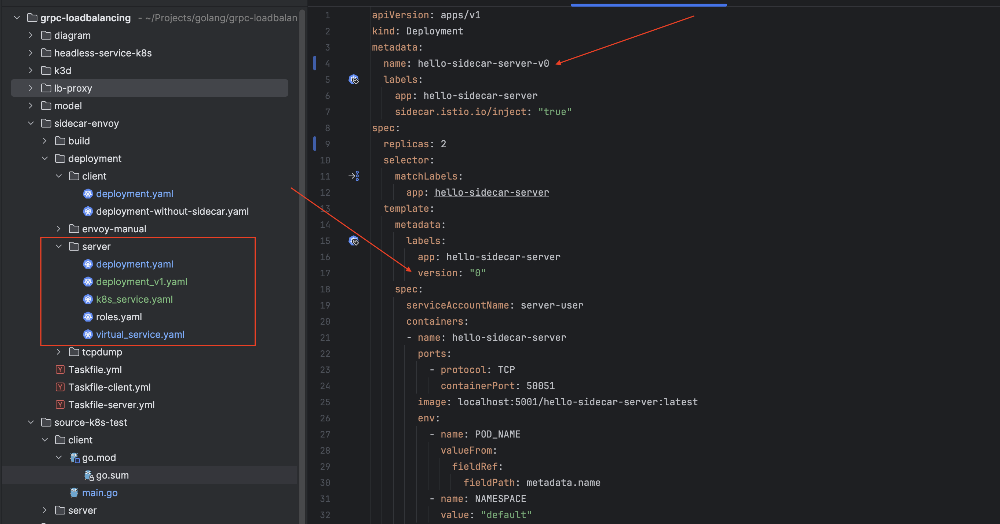
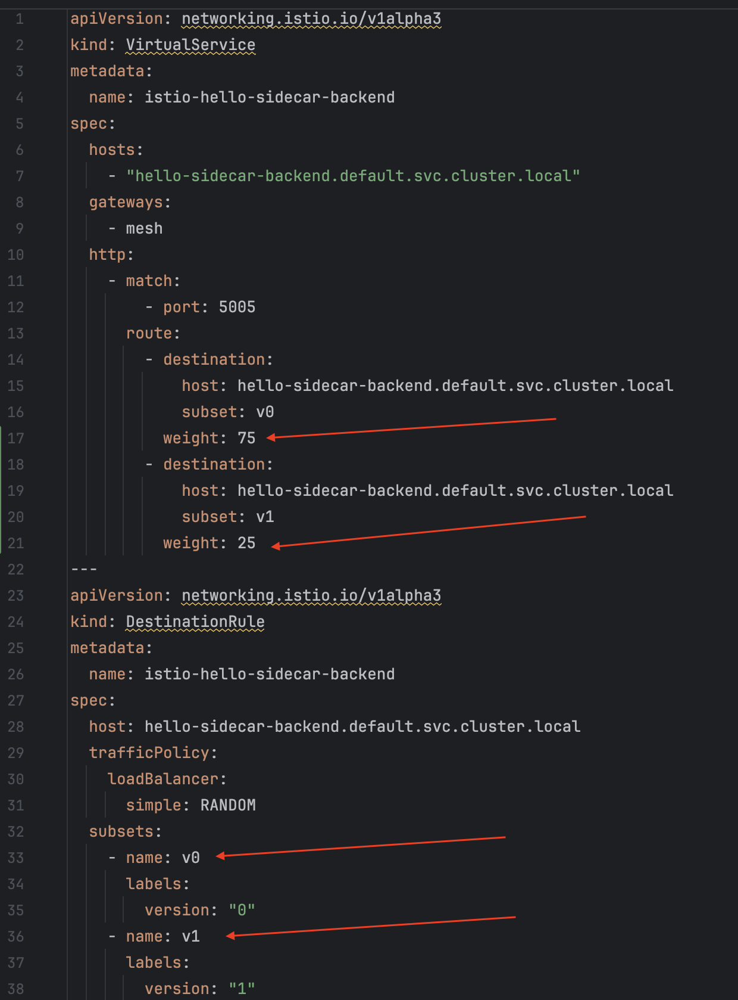

Tiếp theo với chuỗi bài tìm hiểu `gRPC load balancing`, bài viết hôm nay thảo luận về việc sử dụng service mesh để cân bằng tải gRPC trong K8s. Chủ đề chính vẫn là `gRPC load balancing` nên những kiến thức khác mình chỉ lướt qua ở mức vừa đủ để các bạn có thể theo dõi bài viết.

## Service mesh

**Service mesh là gì?**

Service mesh là công cụ tạo ra một lớp hạ tầng xử lý việc giao tiếp giữa các service trong ứng dụng, có một số tính năng nổi bật như:

- Service discovery
- Load balancing
- mTLS
- Observability
- Traceability

giúp tách rời những chức năng không liên quan đến xử lý business ra khỏi phần code của ứng dụng.

Kiến trúc của 1 service mesh:


Như bạn có thể thấy, có 2 thành phần chính trong service mesh:
- `Control plane`: chịu trách nhiệm điều khiển, cấu hình các rule để quản lý mesh.
- `Data plane`: hiện thực các rule từ `control plane`, xử lý quá trình giao tiếp giữa các service trong mesh bằng `sidecar proxy`, thành phần được triển khi cùng với service.

## Service mesh trong K8s

Mình sử dụng `Isito - Envoy proxy` để hiện thực trong bài viết này.

***[Isito - Envoy](https://istio.io/latest/docs/ops/deployment/architecture/)***

Isito là một công cụ triển khai service mesh, chúng ta có thể triển khai trên K8s hoặc cụm máy ảo.
- `Control plane`: Istiod.
- `Data plane`: `Envoy proxy` được triển khai cùng với service trong cùng một pod, `proxy` như một lớp bọc ở ngoài service, chặn và xử lý tất cả in-bound, out-bound traffic của service để hiện thực các chức năng liên quan đến giao tiếp.

*Mô hình hoạt động cân bằng tải gRPC như sau:*


- `Istiod` sẽ đóng vai trò `service discovery` và cập nhật cho `envoy proxy` khi có sự thay đổi ở backend server như scale-out, scale-in.
- `Envoy proxy` sẽ cân bằng tải `gRPC` ở `layer 7` sau khi tạo connection trực tiếp tới các backend servers.

***kube-proxy***

Để có sự so sánh tại sao chúng ta cần dùng một công cụ ngoài K8s để cân bằng tải, hãy cùng phân tích qua những thành phần sẵn có của K8s.

`Service` trong K8s sử dụng `kube-proxy` để thực hiện việc giao tiếp network, `kube-proxy` sử dụng `iptables` để forward các gói tin từ client đến pod đang chạy các server, hoạt động chủ yếu ở `layer 4`, ở vai trò này nó giống như một load balancing hoạt động ở `layer 4`. Nếu sử dụng `kube-proxy`, chúng ta phải sử dụng `connection pool` để đảm bảo việc cân bằng tải hoạt động đúng như mong muốn.

## Hiện thực / Kiểm tra

Để hiện thực mô hình này, mình sử dụng những thứ sau:

- [k3d](https://k3d.io): chạy k8s ở máy cá nhân.
- [kubectl](https://kubernetes.io/docs/reference/kubectl/): tương tác với cụm k8s.
- [istio](https://istio.io/latest/) & [envoy-proxy](https://www.envoyproxy.io/): triển khai service mesh trong k8s.
- [task](https://taskfile.dev/#/): làm alias cho các công việc như build hay triển khai, giúp tiết kiện thời gian gõ lệnh trên terminal.

***Server***

Phần code của server đơn giản chỉ có 2 method `unary` và `stream`, trả về `pod name` mỗi khi xử lý request nhằm mục đích thống kê ở phía client.

Mình trích dẫn 2 method gRPC ở đây:

- `SayHello`: unary method của gRPC.
- `SayHelloStream`: stream method của gRPC.

```go
func (s *server) SayHello(ctx context.Context, req *pb.HelloRequest) (*pb.HelloResponse, error) {
	fmt.Printf("server %v receive message\n", s.serverId)
	return &pb.HelloResponse{ServerId: s.serverId}, nil
}

func (s *server) SayHelloStream(stream pb.DemoService_SayHelloStreamServer) error {
	for {
		_, err := stream.Recv()
		if err != nil {
			return fmt.Errorf("failed to receive a request: %v", err)
		}
		fmt.Printf("server %v receive message\n", s.serverId)

		// Send a response back to the client
		res := &pb.HelloResponse{
			ServerId: s.serverId,
		}

		// Send the response to the client
		if err := stream.Send(res); err != nil {
			return fmt.Errorf("failed to send response: %v", err)
		}
	}
}
```

Để triển khai server trong k8s, chúng ta cần:
- Build code thành docker image: `localhost:5001/hello-sidecar-server:latest`.
- Viết file triển khai `Deployment` và một `Service` cho các pod của servers.

Ở đây mình chuẩn bị 2 file `Deployment`, mục đích là triển khai server với 2 version khác nhau.



***Client***

Ở client lần này mình cũng sử dụng 2 method `unary` và `stream` để kiểm tra cách cân bằng tải bằng `envoy proxy` và `kube-proxy`.

Về ý tưởng kiểm tra:
- Tạo nhiều client, mỗi client gửi nhiều request đối với `unary method` và nhiều stream đối với `stream method`.
- Thống kê số lượng request được xử lý bởi mỗi server.

**unary test**

```go
func unaryTest(index int, wg *sync.WaitGroup) {
	defer wg.Done()
	target := getTarget()
	conn, err := grpc.NewClient(target, grpc.WithTransportCredentials(insecure.NewCredentials()))
	if err != nil {
		log.Fatalf("connect to server %v fail: %v", target, err)
	}
	defer func() {
		_ = conn.Close()
	}()

	client := pb.NewDemoServiceClient(conn)

	responses := make(map[string]int)

	fmt.Printf("start gRPC client %v\n", index)

	for i := 0; i < numberOfRequests; i++ {
		res, err := client.SayHello(context.Background(), &pb.HelloRequest{Name: "client"})
		if err != nil {
			log.Printf("client %v failed to call SayHello: %v", index, err)
			continue
		}
		responses[res.ServerId] = responses[res.ServerId] + 1
		time.Sleep(requestInterval)
	}
	fmt.Printf("client %v make %v requests, received all response from %v server(s), detail: %+v\n", index, numberOfRequests, len(responses), responses)
}
```

**stream test**

```go
func streamTest(index int, wg *sync.WaitGroup) {
	defer wg.Done()
	target := getTarget()
	conn, err := grpc.NewClient(target, grpc.WithTransportCredentials(insecure.NewCredentials()))
	if err != nil {
		log.Fatalf("connect to server %v fail: %v", target, err)
	}
	defer func() {
		_ = conn.Close()
	}()

	client := pb.NewDemoServiceClient(conn)

	responses := make(map[string]int)

	fmt.Printf("start gRPC client %v\n", index)
	stream, err := client.SayHelloStream(context.Background())
	if err != nil {
		log.Fatalf("could not call SayHello: %v", err)
	}

	for i := 0; i < numberOfRequests; i++ {
		req := &pb.HelloRequest{
			Name: fmt.Sprintf("client %d", i),
		}
		if err := stream.Send(req); err != nil {
			log.Fatalf("failed to send request: %v", err)
		}
		response, err := stream.Recv()
		if err != nil {
			log.Fatalf("failed to receive response: %v", err)
		}
		responses[response.ServerId] = responses[response.ServerId] + 1
	}
	if err := stream.CloseSend(); err != nil {
		log.Fatalf("failed to close stream: %v", err)
	}
	fmt.Printf("client %v make %v requests, received all response from %v server(s), detail: %+v\n", index, numberOfRequests, len(responses), responses)
}
```

Triển khai 2 phiên bản client bằng k8s có sử dụng `envoy proxy` và không sử dụng `envoy proxy`, có một số điểm lưu ý sau:
- `sidecar.istio.io/inject: "false"`: ngăn chặn `istiod` inject sidecar proxy vào pod của client.
- `hello-sidecar-backend.default.svc.cluster.local`: endpoint của service backend.
- các thông số về số lượng gRPC client, số request hay số stream mỗi gRPC client có thể được thay đổi ở file `Deployment`.

Ví dụ file `Deployment yaml` triển khai client có `envoy proxy`.
```yaml
apiVersion: apps/v1
kind: Deployment
metadata:
  name: hello-sidecar-client
  labels:
    app: hello-sidecar-client
spec:
  replicas: 1
  selector:
    matchLabels:
      app: hello-sidecar-client
  template:
    metadata:
      labels:
        app: hello-sidecar-client
    spec:
      containers:
      - name: hello-sidecar-client
        image: localhost:5001/hello-sidecar-client:latest
        env:
          - name: POD_NAME
            valueFrom:
              fieldRef:
                fieldPath: metadata.name
          - name: NAMESPACE
            value: "default"
          - name: GRPC_SERVER_ADDR
            value: "hello-sidecar-backend.default.svc.cluster.local"
          - name: GRPC_SERVER_PORT
            value: "5005"
          - name: CLIENT_CONNECTION
            value: "3"
          - name: STREAMER_PER_CONNECTION
            value: "10"
          - name: REQUEST_PER_CLIENT
            value: "5000"
        resources:
          limits:
            cpu: "200m"
            memory: "250Mi"
          requests:
            cpu: "100m"
            memory: "100Mi"
```

File `yaml` triển khai client không có `envoy proxy` chỉ khác phần `annotations`.
```yaml
spec:
  replicas: 1
  selector:
    matchLabels:
      app: hello-client
  template:
    metadata:
      labels:
        app: hello-client
      annotations:
        sidecar.istio.io/inject: "false"
```

## Kiểm tra

Triển khai server và client bằng lệnh `task server:deploy` và `task client:deploy`.


***kube-proxy***

`kube-proxy` cân bằng tải ở `layer 4` nên tất cả request từ 1 client sẽ được xử lý bởi 1 backend server duy nhất.


***envoy-proxy***

- `Envoy proxy` cân bằng tải ở `layer 7` nên khi kiểm tra với `unary method`, requests từ 1 client có thể được xử lý bởi cả 3 backend servers.
- Đối với `stream method`, tất cả messages trên 1 stream đều được xử lý bởi 1 backend server duy nhất, đảm bảo tính đúng đắn về chức năng của protocol.


## [Traffic management](https://istio.io/latest/docs/concepts/traffic-management/#introducing-istio-traffic-management)

Trong lúc giới thiệu về service mesh, mình có đề cập đến 1 vai trò hàng đầu của nó là hỗ trợ, quản lý giao tiếp giữa services. Phần này mình sẽ phát triển thêm ví dụ ở phần trước để minh hoạ thêm yếu tố quản lý traffic giữa các service.

Khi ứng dụng của bạn triển khai một tính năng mới, hay cập nhật tính năng cũ và bạn chỉ muốn triển khai đến một nhóm nhỏ người dùng, bạn có thể sử dụng các cấu hình routing để thực hiện việc này bằng cách:
- Sử dụng label để phân biệt các phiên bản mới của server.
- Cấu hình routing để thay đổi tỉ lệ traffic đến phiên bản cũ và mới.

Để minh hoạ ví dụ này, mình sử dụng thêm 2 thành phần của Istio là `VirtualService` và `DestinationRule`:

- `VirtualService`: định nghĩa cách request được gửi tới một địa chỉ.
- `DestinationRule`: định nghĩa cách request được gửi đến các pod sau khi được áp dụng chính sách routing từ `VirtualService`, bạn có thể hiểu có 2 bậc routing ở đây.



Tỉ lệ giữa 2 phiên bản của server là 3:1.

Để chạy chương trình, chúng ta chỉ cần chạy `task server:deploy` và `task client:deploy` sau khi đã cập nhật các file yaml. 

**Kết quả cho thấy đúng với chúng ta kì vọng**, tỉ lệ request được xử lý bởi 2 phiên bản của server gần bằng 3:1.


## Đánh giá

Mình chỉ tập trung đánh giá ưu/nhược điểm liên quan đến tính năng cân bằng tải.

***Ưu điểm***

- Service mesh cung cấp cơ chế cân bằng tải ở tầng ứng dụng, giải quyết được vấn đề cân bằng tải connection của `kube-proxy`.
- Cung cấp cơ chế `service discovery`.
- Hỗ trợ đa dạng các chế độ cân bằng tải, phù hợp với các ứng dụng triển khai phức tạp.

***Nhược điểm***

- Tăng độ phức tạp trong các mô hình triển khai.
- Thêm 1 lớp vào việc giao tiếp giữa các service, tăng latency của request cũng như khó debug khi có lỗi xảy ra.

## Tổng kết

Qua bài viết này, mình đã hiện thực service mesh trong K8s để cân bằng tải gRPC cũng như kiểm tra lại các lý thuyết đã được phân tích ở các bài viết trước. Một số kiến thức quan trọng cần lưu ý:
- Mô hình hoạt động của service mesh, side-car pattern.
- `Kube-proxy` hoạt động cân bằng tải ở `L4`.
- `Envoy proxy` hoạt động cân bằng tải ở `L7`.
- `Istio và Envoy proxy` hỗ trợ đa dạng các cấu hình quản lý traffic.


## Mã nguồn

Bạn có thể tham khảo mã nguồn ở repository [grpc-loadblancing](https://github.com/dntam00/grpc-loadbalancing/tree/main/sidecar-envoy).

## Tham khảo

- [Istio](https://istio.io/)
- [Istio in Action](https://www.manning.com/books/istio-in-action) by Christian E. Posta and Rinor Maloku.
