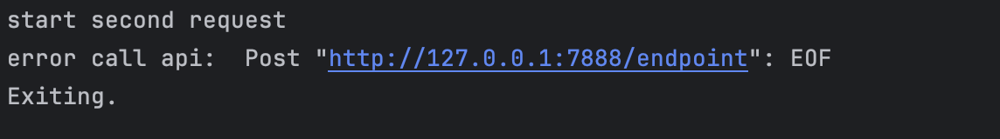
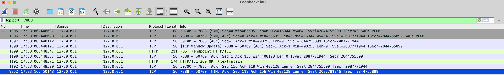

<!-- `HTTP` is a application protocol based on TCP transport (layer 4 OSI), I have a related post [[TCP Close connection](https://notes-ngtam.pages.dev/posts/close-tcp)], you could read it before going ahead. -->


`HTTP` là 1 giao thức ở tầng ứng dụng (application) sử dụng giao thức `TCP` ở tầng vận chuyển (transport), trước đó mình cũng có viết 1 bài liên quan đến `TCP`, bạn có thể đọc trước [[TCP Close connection](https://notes-ngtam.pages.dev/posts/close-tcp)].

<!-- ## Why do we want to reuse connection? -->
## Pooling

<!-- We all heard about `pooling technique`, from `HTTP` to `GRPC`, database connection, it's very popular. T -->
HTTP là một giao thức `client-server` dựa trên `TCP`, để thực thi 1 yêu cầu, phía `client` sẽ cần khởi tạo `TCP` connection tới `server` bằng cơ chế bắt tay 3 bước (`3-way handshake`), `SYN -> SYN/ACK -> SYN`, ngoài ra, nếu sử dụng TLS thì sau quá trình trên còn diễn ra thêm quá trình trao đổi khoá để mã hoá message, chi phí để liên tục mở và đóng các connection là rất lớn và lãng phí nếu ứng dụng cần gửi một cách thường xuyên.

Để giải quyết vấn đề này, một kĩ thuật đã được áp dụng rộng rãi, đó là `pooling`, thay vì tạo mới connection mỗi lần gửi yêu cầu thì chúng ta sẽ tạo ra một tập các connection và tái sử dụng nó.

## HTTP client trong Go

Ở phần này mình sử dụng phiên bản `Go v1.23` để phân tích.

>If the returned error is nil, the Response will contain a non-nil Body which the user is expected to close. If the Body is not both read to EOF and closed, the Client's underlying RoundTripper (typically Transport) may not be able to re-use a persistent TCP connection to the server for a subsequent "keep-alive" request. 

Theo phần chú thích cho hàm [Do](https://cs.opensource.google/go/go/+/refs/tags/go1.23.3:src/net/http/client.go;l=567), `HTTP client` sẽ tái sử dụng connection để gửi yêu cầu đến server nếu client đọc phần `body response` đến `EOF` trong trường hợp không có lỗi xảy ra. 

Để ngăn việc tái sử dụng `TCP connection`, chúng ta có thể làm bằng 2 cách:

1. Gán biến `Close` của struct [Request](https://cs.opensource.google/go/go/+/refs/tags/go1.23.3:src/net/http/request.go;l=112) thành `true` khi khởi tạo 1 request mới.
2. Gán biến `DisableKeepAlives` của struct [Transport](https://cs.opensource.google/go/go/+/refs/tags/go1.23.3:src/net/http/transport.go;l=96) thành `true` khi khởi tạo `HTTP client`

## Vấn đề

Khi triển khai ứng dụng trong 1 thời gian dài, mình thấy có một vài API xảy ra lỗi `EOF`, lỗi này xảy ra khi server và client đều có tác động đến connection theo 2 hướng khác nhau:

- `server`: đóng connection bởi vì `idle timeout`.
- `client`: tái sử dụng connection để gửi request.

Trích dẫn docs từ [transportReadFromServerError](https://cs.opensource.google/go/go/+/refs/tags/go1.23.3:src/net/http/transport.go;l=96)

```go
// transportReadFromServerError is used by Transport.readLoop when the
// 1 byte peek read fails and we're actually anticipating a response.
// Usually this is just due to the inherent keep-alive shut down race,
// where the server closed the connection at the same time the client
// wrote. The underlying err field is usually io.EOF or some
// ECONNRESET sort of thing which varies by platform. But it might be
// the user's custom net.Conn.Read error too, so we carry it along for
// them to return from Transport.RoundTrip.
type transportReadFromServerError struct {
	err error
}
```

Khi khởi tạo 1 connection mới tới server, hàm [dialConn](https://cs.opensource.google/go/go/+/refs/tags/go1.23.3:src/net/http/transport.go;l=1684), Go sử dụng 2 goroutine để đọc và viết trên mỗi connection.

```go
func (t *Transport) dialConn(ctx context.Context, cm connectMethod) (pconn *persistConn, err error) {
    // omitted for brevity
    pconn.br = bufio.NewReaderSize(pconn, t.readBufferSize())
    pconn.bw = bufio.NewWriterSize(persistConnWriter{pconn}, t.writeBufferSize())

    go pconn.readLoop()
    go pconn.writeLoop()
    return pconn, nil
}
```

Khi thực hiện request, hàm `roundTrip` sẽ tương tác với 2 goroutine trên thông qua channel và dùng `select case` để xử lý các trường hợp có thể xảy ra như `request timeout`, `read error`,...

```go
func (pc *persistConn) roundTrip(req *transportRequest) (resp *Response, err error) {
    // omitted for brevity

    // Write the request concurrently with waiting for a response,
    // in case the server decides to reply before reading our full
    // request body.
    startBytesWritten := pc.nwrite
    writeErrCh := make(chan error, 1)
    pc.writech <- writeRequest{req, writeErrCh, continueCh}

    resc := make(chan responseAndError)
    pc.reqch <- requestAndChan{
    	treq:       req,
    	ch:         resc,
    	addedGzip:  requestedGzip,
    	continueCh: continueCh,
    	callerGone: gone,
    }

    // omitted for brevity

    for {
        testHookWaitResLoop()
        select {
        case err := <-writeErrCh:
            if debugRoundTrip {
            	req.logf("writeErrCh recv: %T/%#v", err, err)
            }
            if err != nil {
            	pc.close(fmt.Errorf("write error: %w", err))
            	return nil, pc.mapRoundTripError(req, startBytesWritten, err)
            }
            if d := pc.t.ResponseHeaderTimeout; d > 0 {
            	if debugRoundTrip {
            		req.logf("starting timer for %v", d)
            	}
            	timer := time.NewTimer(d)
            	defer timer.Stop() // prevent leaks
            	respHeaderTimer = timer.C
            }
        case <-pcClosed:
            select {
            case re := <-resc:
            	// The pconn closing raced with the response to the request,
            	// probably after the server wrote a response and immediately
            	// closed the connection. Use the response.
            	return handleResponse(re)
            default:
            }
            if debugRoundTrip {
            	req.logf("closech recv: %T %#v", pc.closed, pc.closed)
            }
            return nil, pc.mapRoundTripError(req, startBytesWritten, pc.closed)
        case <-respHeaderTimer:
            if debugRoundTrip {
            	req.logf("timeout waiting for response headers.")
            }
            pc.close(errTimeout)
            return nil, errTimeout
        case re := <-resc:
            return handleResponse(re)
        case <-ctxDoneChan:
            select {
            case re := <-resc:
            	// readLoop is responsible for canceling req.ctx after
            	// it reads the response body. Check for a response racing
            	// the context close, and use the response if available.
            	return handleResponse(re)
            default:
            }
            pc.cancelRequest(context.Cause(req.ctx))
        }
    }
}
```
Với cách hoạt động như trên, mình quyết định reproduce lỗi này với sự kết hợp của công cụ debug trong `GoLand`.

Trước hết, cấu hình `idle timeout` ở server và client như sau:

```go
// server
srv := &http.Server{
    Addr:        ":" + "7888",
    Handler:     handlers.CORS(originsOk, headersOk, methodsOk)(r),
    IdleTimeout: 10 * time.Second,
}

// client
func NewTransport() http.RoundTripper {
	t := http.DefaultTransport.(*http.Transport).Clone()
	t.MaxConnsPerHost = 1
	t.IdleConnTimeout = 30 * time.Second // lớn hơn server là được
	t.MaxIdleConns = 1
	t.MaxIdleConnsPerHost = 1
	return t
}
```

Mình sẽ gửi 2 request với phương thức `POST` (phương thức POST không có tính `idempotency`, tránh HTTP client retry, có thể xem thêm ở hàm [isReplayable](https://cs.opensource.google/go/go/+/refs/tags/go1.23.3:src/net/http/request.go;l=1543)) với các bước:
1. đặt breakpoint sau khi lấy connection từ pool và hàm writeLoop, tạm thời tắt tất cả breakpoint này.
2. gửi thành công request đầu tiên.
3. bật breakpoint lên.
4. dừng ở breakpoint sau khi lấy connection, đợi 2 giây rồi chạy tiếp, tới hàm writeLoop dừng một nhịp nữa.


Kết quả sau vài lần thử thì mình cũng lấy được lỗi `EOF` rồi ~.


Sử dụng wireshark thì thấy được khi dừng ở bước 4, server sẽ gửi gói tin `FIN` để đóng `idle connection`.



Cách tốt hơn là bạn có thể gửi 1 số lượng lớn request vào những lúc server đóng connection, tuy nhiên mình thử vài lần không được nên sử dụng cách này.

## Giải pháp

Để xử lý vấn đề trên có vài cách sau:

- Cấu hình `idle timeout` ở phía `client` thấp hơn `server`.
- Retry request, tuy nhiên phương pháp này cần được cân nhắc cẩn thận vì tính chất `idempotency` của request.

## Tham khảo

[[TIL] Go HTTP client reuse connection](https://medium.com/@p408865/til-go-http-client-reuse-connection-5d8c48731dec)

## Mã nguồn

[[Http server & client]](https://github.com/dntam00/go-notes/tree/main/http)