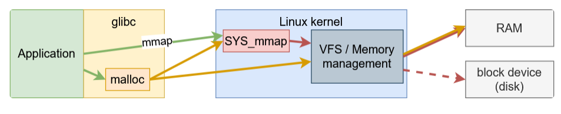
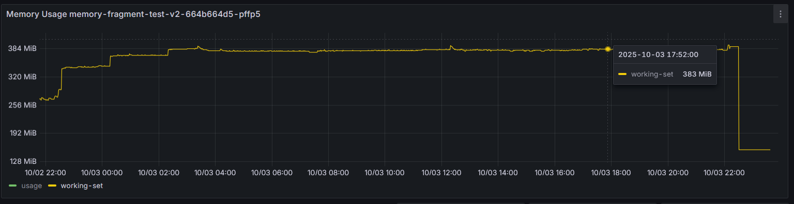

## Mở bài

Sau khi được trang bị thêm kiến thức từ các bài blog của các bậc tiền bối khắp từ Đông sang Tây và làm một số kiểm thử, mình xin viết tiếp chuyên đề về bộ nhớ của một chương trình Java được triển khai trong container dựa trên hệ điều hành Linux.

Từ bài trước, mình đã đề cập đến hiện tượng RSS của container chạy 1 chương trình Java cứ tăng nhưng kết quả của native memory tracking không thay đổi là bao, trong trường hợp này, thủ phạm không đến trực tiếp từ JVM.

## Cách JVM cấp phát vùng nhớ trong Linux

Có thể chia các loại vùng nhớ thành 2 nhóm dựa trên cách thức JVM cấp phát vùng nhớ:
- `Heap`.
- `Off-heap memory`.
    - Được yêu cầu cấp phát từ chính chương trình Java:
        - Direct byte buffer (NIO).
    - Được yêu cầu cấp phát từ JVM:
        - Metaspace.
        - Code cache.
        - JVM Internal data structures.
        - Thread stacks.
        - ...

JVM sử dụng 2 cơ chế sau để yêu cầu cấp phát vùng nhớ từ hệ điều hành:
- `Heap`: `mmap()` syscall.
- `Off-heap memory`: `malloc()` function của thư viện `glibc`.

Bài này mình đang bàn đến đến vấn đề phân mảnh vùng nhớ của Off-heap nên mình sẽ nói qua về thư viện `glibc` và `malloc`.

### malloc interface trong glibc 

`glibc` là một thư viện quản lý vùng nhớ được viết bằng C và được sử dụng rộng rãi, thư viện này được thiết kế ban đầu cho các chương trình đơn luồng, được phát triển thêm sau này để phục cho các ứng dụng đa luồng.

Từ tầng ứng dụng, khi muốn cấp phát vùng nhớ chúng ta có thể gọi hàm `malloc`:

```
void *malloc(size_t size);
```

đây là một interface trong `thư viện chuẩn của C`, được hiện thực trong thư viện `glibc` bằng các `syscall` như `mmap`, `brk`, `sbrk`. Đây là một hàm quá quen thuộc với sinh viên vào những ngày đầu học lập trình ở đại học ;)). Thực tế chúng ta có thể gọi trực tiếp các `syscall` khi lập trình, tuy nhiên đây là những việc rất phức tạp để làm và nếu làm không khéo, sự cố sẽ xảy ra về cả tính đúng đắn của chương trình cũng như hiệu năng. Từ đó các thư viện ra đời để giải quyết vấn đề giúp lập trình viên. 

Ý tưởng của `malloc` yêu cầu một vùng nhớ lớn trước và trả về cho OS nếu lượng sử dụng của ứng dụng ít hơn mức này, nhằm giảm số lượng `syscall` cần gọi và giảm độ phức tạp của mã nguồn ứng dụng.

`malloc` sủ dụng các thuật ngữ sau để làm việc với vùng nhớ:
- `arena`: một cấu trúc dữ liệu để quản lý vùng nhớ heap, có lock để quản lý xung đột trong quá trình cấp phát.
- `heap`: một vùng nhớ liên tục có thể chia nhỏ thành các `chunk` để cấp phát, một heap chỉ được quản lý bởi 1 `arena`.
- `chunk`: đơn vị có thể được cấp phát cho ứng dụng và giải phóng, có thể kết hợp với các `chunk` liền kề để tạo ra một vùng nhớ lớn hơn.
- `memory`: phần vùng nhớ của ứng dụng được ánh xạ trên RAM hoặc trên ổ đĩa (swap).



### Vấn đề phân mảnh vùng nhớ

Trong thiết kế hiện thực `malloc` của `glibc`, lập trình viên được kì vọng giải phóng vùng nhớ theo thứ tự ngược với lúc cấp phát, nếu không thì vùng nhớ có thể không được sử dụng nhưng vẫn không được trả về cho hệ điều hành (mình đang nói về hiện thực mặc định).

Lấy ví dụ ở 2 hình tiếp theo, ứng dụng yêu cầu cấp phát 3 `chunks`: `1KB, 40KB, 100KB`.


Sau đó giải phóng 2 `chunks`: `40KB, 100KB`, 2 `chunks` này được hợp lại và trở nên sẵn sàng sử dụng, tuy nhiên nó vẫn được sở hữu bởi ứng dụng và góp phần vào giá trị RSS trong kết quả của lệnh `ps`. Điều này xảy ra là vì `glibc` chỉ có thể trả vùng nhớ từ đỉnh của heap, trong trường hợp này, nếu `chunk 1KB` cũng được giải phóng thì toàn bộ `141KB` sẽ được trả về cho OS.

Đây là một vấn trong những vấn đề chính của các thư viện cấp phát vùng nhớ.


Để giảm tranh chấp lock trong chương trình đa luồng, `glibc` sử dụng logic sau trong quá trình cấp phát `chunk`:
- 1 thread sử dụng `arena` mà nó đã sử dụng ở lần gần nhất, bắt đầu bằng cách lấy mutex lock trên arena này.
- Nếu lock đang được giữ bởi thread khác, nó sẽ thử với `arena` tiếp theo.
- Nếu quá trình lấy lock trên tất cả `arena` đều thất bại, thread sẽ tạo `arena` mới.
- Có giới hạn số lượng `arena` được tạo, mặc định là 8 trên mỗi cpu, có thể thay đổi bằng biến môi trường `MALLOC_ARENA_MAX`, khi tới giới hạn, thread sẽ không tạo mới `arena` nữa mà sẽ chờ các `arena` đang có.

Có 1 sự đánh đổi ở bước đầu tiên, cụ thể: có thể giảm tranh chấp lock nhưng sử dụng vùng nhớ không hiệu quả.

Ví dụ `thread 1` cần một vùng nhớ `20KB`, vì nó sử dụng `arena 1` ở lần gần nhất, nên trong trường hợp này, `1 chunk` mới sẽ được cấp phát thay vì tái sử dụng lại `chunk 20KB` ở `arena 2`.


### Các giải pháp khi sử dụng glibc

- `malloc_trim`: chúng ta có thể gọi hàm `malloc_trim` để bắt `glibc` duyệt qua các `chunks` và trả về cho OS nếu chúng không được sử dụng, tuy nhiên đây là một hàm C và có thể không phù hợp trong một số chương trình hiệu năng cao.
- `MALLOC_ARENA_MAX`: cấu hình số lượng `arenas` tối đa được tạo trên mỗi `core cpu`, giải pháp này có nhược điểm là làm tăng tranh chấp lock giữa các threads.
- `M_MMAP_THRESHOLD`: cấu hình ngưỡng kích thước để chuyển việc cấp phát sang sử dụng syscall `mmap`, giải pháp này có nhược điểm là làm giảm hiệu năng của chương trình về mặt tổng thể vì gọi nhiều `syscall`.

## Giải pháp

Chuyển sang sử dụng các thư viện cấp phát vùng nhớ khác nếu cần thiết :grimacing:.
- `TCMalloc`.
- `Jemalloc`.

Với thư viện `jemalloc`, mình đã thử chạy `server gRPC trên netty` trong 1 ngày để so sánh, và đây là memory của 2 pod.
- Netty sử dụng `Direct Buffers`, tỉ lệ cấp phát, giải phóng cao.
- Netty sử dụng code C thông qua JNI.




Khi sử dụng `jemalloc`, đồ thị bộ nhớ cho thấy sự ổn định hơn, điều này ngụ ý rằng `jemalloc` quản lý và tái sử dụng bộ nhớ hiệu quả hơn so với `glibc` mặc định trong các ứng dụng có tốc độ cấp phát/giải phóng cao như `netty server`.

## Tổng kết

JVM memory là một chủ đề phức tạp việc có những hiểu biết nền tảng về tất cả các thành phần sẽ giúp chúng ta định ra hướng đi rõ ràng hơn trong quá trình theo dõi và xử lý các vấn đề liên quan đến vùng nhớ. Ngoài heap leak thì phân mảnh vùng nhớ native cũng là 1 vấn đề đối với các ứng dụng chạy lâu dài.

## Tham khảo

- https://blog.cloudflare.com/the-effect-of-switching-to-tcmalloc-on-rocksdb-memory-use/
- https://blog.arkey.fr/2020/11/30/off-heap-reconnaissance/
- https://dzone.com/articles/how-much-memory-does-a-java-thread-take
- https://www.baeldung.com/linux/resident-set-vs-virtual-memory-size
- https://www.youtube.com/watch?v=c755fFv1Rnk
- https://github.com/mfleming/performance-resources
<!-- - https://www.javaspecialists.eu/about/heinz/ -->
- https://www.digitalocean.com/community/tutorials/java-jvm-memory-model-memory-management-in-java
- https://blog.arkey.fr/drafts/2021/01/22/native-memory-fragmentation-with-glibc/