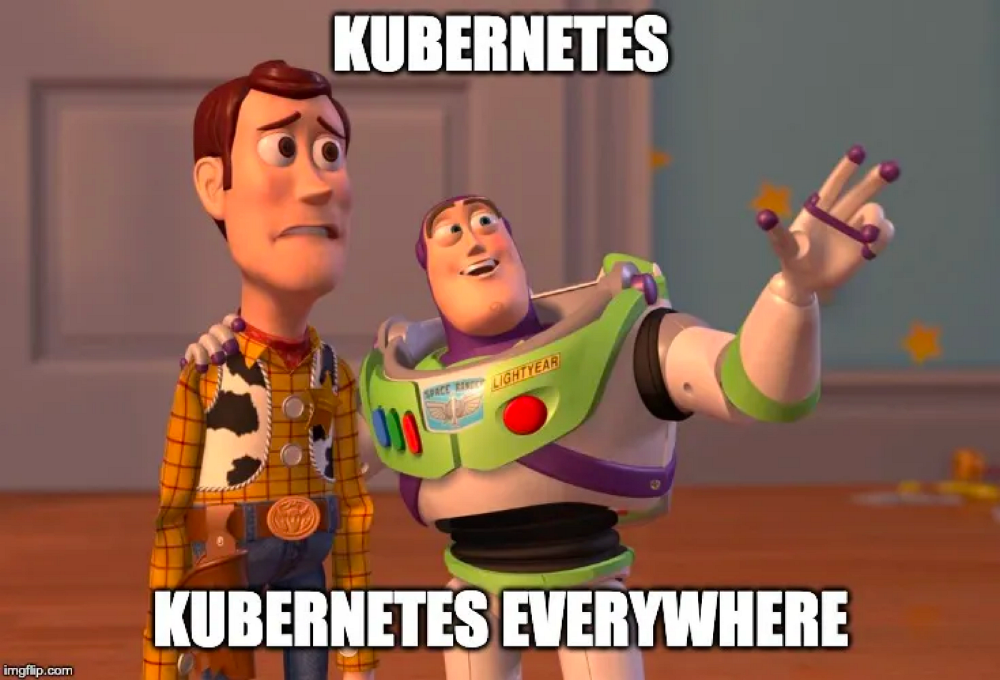

## Vấn đề

Tuần rồi được một đồng nghiệp hỏi về việc service hay bị `OOM (Out Of Memory)` trên môi trường DEV, vừa hay tháng trước học lý thuyết về JVM nên nay mang vào thực hành thử, trong quá trình làm thì nhận có nhiều thứ bản thân đang hiểu sai hoặc chưa hiểu rõ.

Một số ngữ cảnh của service:
- Mã nguồn Java 8.
- Sử dụng G1C garbage collector.
- Webserver xài Tomcat truyền thống, webclient xài Webflux với Netty.
- Triển khai trên k8s với sidecar pattern, istio proxy.


<!--  -->

Đầu tiên thì thấy container service bị `OOMKilled`:
- Pod không bị xoá đi.
- Container bị restart nhiều lần bởi k8s do vượt quá giới hạn bộ nhớ được thiết lập.

Vào xem memory của container thì đúng là `loanh quanh 2GiB`, vừa đúng với giá trị giới hạn. Vậy có phải do ứng dụng có vấn đề hay con số 2GiB quá thấp?

Bước đầu tiên nghĩ tới là heapdump:

```
jcmd 1 GC.heap_dump <path>
```

Điều bất ngờ là kết quả của heapdump chỉ loanh quanh `250MB`.


Con số khá nhỏ so với 2GiB, vậy phải tiếp tục sử dụng chế độ theo dõi memory của JVM để nghiên cứu tiếp.
Khi chạy chương trình, cần thêm tuỳ chọn sau:

```
-XX:NativeMemoryTracking=summary
```

Sau đó, có thể sử dụng lệnh `jcmd` để lấy thông tin:

```
jcmd <pid> VM.native_memory summary scale=MB
```


Thoạt đầu nhìn vào phần `Total`, thấy con số `committed: 2131MB` còn lớn hơn cả giới hạn 2GiB của container, thấy cũng hơi lạ, tại vì mình đang vào bên trong container để chạy lệnh mà, nếu lơn hơn thì container đã bị kill và mình không thể truy cập được rồi.

Ok bắt đầu đi tìm hiểu về các con số trong phần kết quả này, thì thấy JVM có 1 bug liên quan đến NMT (Native Memory Tracking) trên các phiên bản Java 8 cũ:
- https://bugs.openjdk.org/browse/JDK-8191369

Cụ thể là con số `committed` trong phần `stack memory` được hiển thị bằng với số `reserved`. Vậy kết luận đầu tiên là giá trị `committed` ở phần `Total` sẽ phải nhỏ hơn số trong hình.

## Reserved vs Committed

Trước khi đi tiếp thì cần hiểu về 2 khái niệm `reserved` và `committed` trong quản lý bộ nhớ của JVM:

- `Reserved memory`: kích thước vùng nhớ được đảm bảo bởi OS là sẽ sẵn sàng cung cấp cho JVM nếu được yêu cầu, có thể hiểu là lời hứa :V.
- `Committed memory`: kích thước vùng nhớ thực tế đã được OS cấp phát cho JVM để sử dụng.

Vậy nên, `reserved` luôn luôn lớn hơn hoặc bằng `committed`.

Trong 2 số trên thì giá trị `committed` sẽ được k8s sử dụng để so sánh với giới hạn bộ nhớ của container.

***Câu hỏi quan trọng:*** có phải tất cả vùng nhớ trong phần `committed` đều đang chứa dữ liệu (objects, metadata,...), có thể hiểu là `đang được sử dụng`?

Ban đầu thì cũng nghĩ là vậy, cho tới khi hiểu được ý nghĩa của nó và xem lại file `heapdump` ở trên. Câu trả lời chính xác là không, JVM có thể đánh dấu sở hữu vùng nhớ nhưng không nhất thiết phải cấp phát dữ liệu lên đó.

## Giải pháp

Nhìn vào phần `Heap` thì thấy giá trị `committed` bằng với `reserved` là `1Gib`, chiếm 50% số giới hạn của container, con số này được cấu hình từ đâu?

Khi nghiên cứu về process JVM thì có một vài lệnh quan trọng để xem các thông số cấu hình:

```
jcmd <pid> VM.flags
jcmd <pid> VM.command_line
```

Sau khi chạy 2 lệnh trên thì thấy có một cấu hình liên quan tới Heap, đó là `-XX:MaxRAMFraction=2`.

- `MaxRAMFraction`: xác định tỷ lệ phần trăm bộ nhớ vật lý tối đa mà JVM có thể sử dụng cho Heap, giá trị mặc định là `4`, tức là 25% bộ nhớ vật lý.

Cấu hình này giải thích giá trị `reserved` của Heap là `1Gib`, vì giới hạn bộ nhớ của container là `2Gib`.

Quay lại với giá trị thật sự sử dụng của `Heap`, vì chỉ loanh quanh `250MB` nên nghĩ về phương án đầu tiên là làm yêu cầu JVM trả vùng nhớ về cho OS khi không sử dụng, tìm kiếm trên mạng thì thấy có vài cấu hình như sau:

```text
-XX:MinHeapFreeRatio
-XX:MaxHeapFreeRatio
-XX:G1MaxUncommittedCapacity
```

Tuy nhiên mang vào xài thử thì có option không được hỗ trợ, còn lại thì không hoạt động. 

Cuối cùng nghĩ lại thấy `Heap` xài ít quá, mình giảm phần `reserved` của `Heap` xuống còn `512MB` bằng cách sử dụng:

```
-XX:MaxRAMFraction=4
```

Và kết quả thì bộ nhớ của toàn ứng dụng đã giảm xuống mức an toàn.

- Bên trái: service container.
- Bên phải: istio-proxy container.


Tuy nhiên, sau vài ngày thì ứng dụng có xu hướng tăng chậm bộ nhớ, mình xem thử lại về native memory tracking thì thấy các phần trong JVM report không khác nhiều lắm, vậy nguyên nhân nằm ở phần khác.

## Off-heap memory

Thực sự heap chỉ là một phần trong tổng bộ nhớ của JVM và được quản lý trực tiếp bởi JVM, còn một số phần native memory khác không được thể hiện trong báo cáo của JVM, ví dụ như:
- MappedByteBuffer (Mapped files).
- Native libraries allocations (các thư viện C).
- Malloc overhead.

Để theo dõi các phần này thì có thể sử dụng công cụ `pmap`.

Nhìn về tổng quan thì tổng bộ nhớ của container sẽ bao gồm các phần sau:
```
Total memory = Heap + GC + Metaspace + Code Cache + Symbol tables
               + Compiler + Other JVM structures + Thread stacks
               + Direct buffers + Mapped files +
               + Native libraries allocations + Malloc overhead
               + ...
```

Sẽ cần tiếp tục nghiên cứu về phần `Off-heap memory` này trong các bài sau, vì đây là chủ đề phức tạp, cần phải ôn lại kiến thức quản lý bộ nhớ trong hệ điều hành nữa 😳, điểm danh sơ sơ qua là thấy cần xem thêm về:
- Virtual memory vs Physical memory.
- Memory paging.
- Resident Set Size (RSS).
- Cgroup memory limit.

Và bash script để múa nữa :)).

## Tổng kết

Qua quá trình tìm hiểu này, nhận ra được vấn đề nắm được lý thuyết là cực kì quan trọng, có những thứ nhìn vậy nhưng không phải vậy, ví dụ phần `committed` memory của stack ở Java 8. 

Hiểu được tổng thể các vùng nhớ này cũng giúp đưa ra quyết định là xin thêm RAM cho service hay là tối ưu lại ứng dụng.


## Tham khảo

- https://blog.arkey.fr/2020/11/30/off-heap-reconnaissance/
- https://dzone.com/articles/how-much-memory-does-a-java-thread-take
- https://www.baeldung.com/linux/resident-set-vs-virtual-memory-size
- ChatGPT, Gemini AI