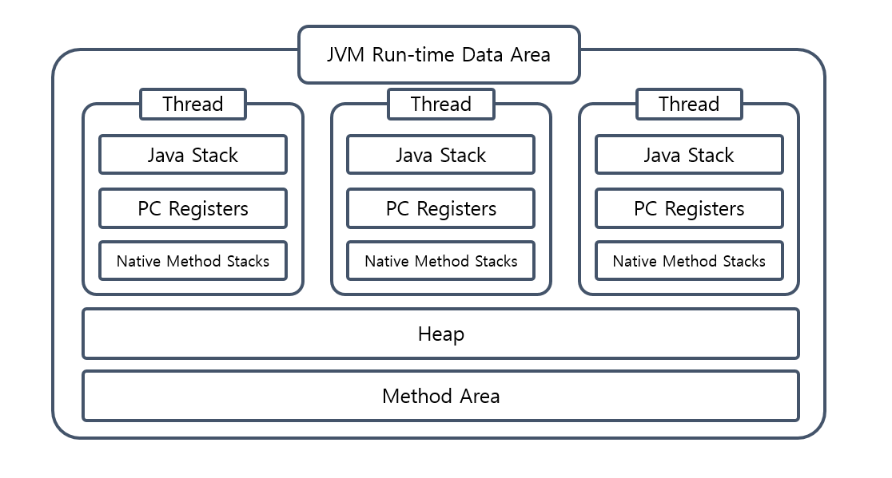

***Thông tin cập nhật:***
- `30/08/2025:` Bổ sung các lệnh để theo dõi vùng nhớ của một chương trình Java.
----


Java virtual machine - JVM  - Máy ảo Java, là máy ảo giúp máy tính thực thi các chương trình viết bằng Java hoặc các ngôn ngữ khác có trình biên dịch tạo ra bytecode. Việc tạo ra JVM giúp ngôn ngữ Java có tính linh động, viết một lần thực thi ở nhiều nơi (`Write Once, Run Anywhere`), cũng như ẩn giấu rất nhiều phần thiết kế, hiện thực phức tạp liên quan đến việc lập trình như quản lý bộ nhớ, sự phụ thuộc, tối ưu thực thi,... để lập trình viên có thể tập trung nhiều hơn vào việc phát triển ứng dụng.

## Tổng quan

Những gì ngôn ngữ Java cung cấp cho lập trình viên có thể gói gọn ở high-level như hình sau:

- `JVM`: trình thực thi bytecode, load class, quản lý vùng nhớ, 
- `JRE`: bao gồm `JVM`, các module thư viện cốt lõi của Java (Object, String, Thread, ClassLoader,...), các thư viện tiện ích khác như log, sql, desktop và các thư viện native được viết bằng C/C++.
    - Bắt đầu từ Java 9, `JRE` được xem như là thành phần luận lý vì kể từ Java 9, Java ra mắt khái niệm module, Oracle không cung cấp riêng rẽ JRE nữa mà gợi ý người dùng có thể tự build môi trường runtime tuỳ thuộc vào ứng dụng bằng `jlink`. 
- `JDK`: bao gồm `JRE` và các công cụ hỗ trợ phát triển (javac để biên dịch, java để chạy, jar để đóng gói,...).


Vậy từ thông tin trên, nếu cần thực thi bytecode, chỉ cần tạo môi trường runtime là đủ.

## JVM

Thành phần quan trọng bậc nhất trong Java. Những việc như quản lý bộ nhớ, thu dọn rác (garbage collector), tối ưu thực thi bytecode được JVM hiện thực thay cho lập trình viên.

***Có thể thấy JVM được không?***

JVM là trình thực thi chương trình viết bằng Java hoặc các ngôn ngữ khác có thể biên dịch ra bytecode, vậy trước tiên nó phải chạy được trong máy tính, vậy nó là 1 process, có thể xem các process jvm trong máy bằng lệnh `jcmd -l` được cung cấp bởi JDK.

```java
55784 jdk.jcmd/sun.tools.jcmd.JCmd -l
85065 org.lift.backend.BackendApplication
69932 com.intellij.idea.Main
```

Tên chương trình là tên đầy đủ của class chứa hàm main.

***Vậy bên trong JVM có những thành phần nào?***


### Class loader subsystem

Thành phần chịu trách nhiệm định vị, nạp (`loading`), liên kết (`linking`), khởi tạo (`initialization`) các class vào JVM.

1. Nạp class: nạp class từ thư viện core hoặc các file bytecode.
2. Liên kết: kiểm tra tính đúng đắn của các file class, cấp phát vùng nhớ cho các biến, khởi tạo giá trị mặc định.
3. Khởi tạo: chạy các đoạn code khởi tạo trong class (`static { ... }`).

Có 3 loại `class loader` được cung cấp bởi JVM, mỗi loại hoạt động với các đối tượng khác nhau.

- `Bootstrap classLoader`: loader duy nhất được hiện thực bằng native code thay vì Java code, chịu trách nhiệm load các class cần thiết được yêu cầu bởi JVM, ví dụ `java.base`.
- `Platform Class Loader`: load các Java SE modules (`Java Platform, Standard Edition java.sql,...`), customs module được cung cấp bởi lập trình viên.
    + [Hướng dẫn [phân loại module](https://stackoverflow.com/questions/76699669/which-exact-classes-are-loaded-by-platform-classloader)]
- `Application classLoader`: load các class trong đường dẫn classpath của ứng dụng (`-cp` hay biến môi trường `CLASSPATH`).

Ba loại loader này kế thừa nhau, theo thứ tự cha - con là `Bootstrap` > `Extension` > `Application`, ngoài ra lập trình viên có thể tự hiện thực các lớp loader và sử dụng.

#### Nguyên tắc

1. Nguyên tắc uỷ thác (parent delegation principle): JVM sử dụng nguyên lý uỷ quyền cho class cha khi load class, tức là khi có yêu cầu, `load loader` đẩy yêu cầu lên cho lớp cha của nó trước, nếu không tìm thấy thì nó sẽ xử lý yêu cầu. Nguyên lý làm việc này phù hợp với việc chia trách nhiệm cho từng loại `class loader`, ví dụ đối với những class core của Java, chỉ có `Bootstrap classLoader` mới có quyền load, loại trừ khả năng lập trình viên tạo các class trùng tên với thư viện core và thay đổi hành vi, tóm lại là tăng tính bảo mật, tránh lặp lại công việc của nhau.

```java
// Trích dẫn hàm ClassLoader#loadClass.
protected Class<?> loadClass(String name, boolean resolve)
        throws ClassNotFoundException
    {
        try {
            if (parent != null) {
                c = parent.loadClass(name, false);
            } else {
                c = findBootstrapClassOrNull(name);
            }
        } catch (ClassNotFoundException e) {
            // ClassNotFoundException thrown if class not found
            // from the non-null parent class loader
        }
    }
```

2. Nguyên tắc hiển thị (visibility principle): chỉ cung cấp khả năng hiển thị cho trình nạp của class con để xem tất cả các class được tải bởi một parent class, chứ không phải ngược lại.

3. Nguyên tắc duy nhất (uniqueness principle): mỗi class sẽ chỉ được tải một lần.

4. Nguyên tắc lười (lazy loading principle): class được nạp theo yêu cầu sử dụng thay vì được nạp khi JVM khởi tạo.

#### Code

1. [Ví dụ cách hiện thực [custom class loader](https://github.com/dntam00/custom-classloader/blob/main/src/main/java/club/shengsheng/MyClassLoader.java)].

2. [Ví dụ cách xem [class loader của một class cụ thể](https://github.com/dntam00/java-notes/blob/main/src/main/java/loader/Loader.java)].

```java
public static void main(String[] args) {
    System.out.println("Classloader of ArrayList:"
                                + ArrayList.class.getClassLoader());
    System.out.println("Classloader of DriverManager:"
                                + DriverManager.class.getClassLoader());
    System.out.println("Classloader of Loader:"
                                   + Loader.class.getClassLoader());
}
```

Chạy mã nguồn (2) được kết quả:

1. `ArrayList` thuộc thư viện core nên được load bởi `Bootstrap`, loader này được viết bằng native code nên lúc in ra sẽ thấy `null`.
2. `DriverManager` thuộc module `java.sql` và được load bởi `Platform loader`.
3. `Loader` là một class bình thường và được load bởi `AppClass loader`.


### Runtime data area


JVM chia bộ nhớ thành nhiều vùng dữ liệu để lưu trữ các đối tượng khác nhau:

1. `Method area`: khái niệm luận lý, HotSpot JVM hiện thực phần này với tên gọi `Metaspace` sử dụng **native memory** của hệ điều hành (trước Java 9 gọi là `PermGen`, sử dụng heap), lưu trữ các thông tin:
    - Class metadata.
    - Runtime constant pool.
    - Bytecode của hàm.
    - Biến static: giá trị của kiểu dữ liệu primitive hoặc giá trị tham chiếu.
2. `Stack`: JVM sử dụng stack (cấu trúc LIFO) để quản lý việc gọi hàm:
    - Cơ chế:
        - Gọi hàm -> tạo ra frame và push lên stack.
        - Thực thi xong hàm -> pop frame ra khỏi stack.
    - Frame chứa dữ liệu về hàm đang được thực thi, bao gồm một số thông tin sau:
        - `Mảng biến cục bộ và tham số`: truy xuất theo index, nếu là hàm instane thì biến `this` được đánh index 0, các index 1 trở đi được dành cho tham số và biến cục bộ.
            * Các kiểu dữ liệu như `int`, `float`, `reference` chiếm 1 slot index.
            * Các kiểu dữ liệu `long`, `double` chiếm 2 slot index.
        
        ***-> Xem bytecode sẽ thấy rõ.***

        - `Stack toán hạng`: về mặt cấu trúc dữ liệu thì giống với stack để chứa frame. JVM là một stack machine, nó xử lý các câu lệnh bằng cách thao tác với dữ liệu trên stack:
            * Ví dụ: ở stack đang có 2 số 1 và 2, khi thực thi chỉ dẫn `iadd`, JVM sẽ lấy 2 phần tử ở trên stack và cộng lại với nhau (bởi cpu), sau đó đẩy lại kết quả vào stack. Ví dụ với phép cộng `1 + 2`:
                * Bytecode: `iconst_1 → iconst_2 → iadd → istore_1`
                * Stack toán hạng: `[] → [1] → [1,2] → [3]`

        - `Liên kết động`:  Tham chiếu các hằng số đến địa chỉ vùng nhớ vụ thể, ví dụ trong hàm có sử dụng các hằng string và gán vào biến (`String var = "hello"`), thì stack frame cần lưu tham chiếu này.

        - `Địa chỉ trả về`: lưu địa chỉ của hàm gọi để trình thông dịch có thể thực thi tiếp sau khi kết thúc gọi hàm hiện tại.

3. `Heap`: JVM sử dụng heap để lưu object (class instances, array, String pool), đây là vùng dữ liệu có sự hoạt động của GC và gây ra nhiều vấn đề đối với các ứng dụng phức tạp như tràn bộ nhớ, GC chạy gây ảnh hưởng đến hiệu năng của ứng dụng,...

4. `PC registers`: lưu trữ địa chỉ của lệnh đang được thực thi.

5. `Native method stack`: lưu trữ thông tin liên quan đến việc sử dụng các hàm native của các ngôn ngữ khác như C/C++.

Tiếp theo, hình sau thể hiện mối quan hệ của các vùng nhớ ở trên với thread, đây là điểm kiến thức quan trọng cần nắm khi lập trình với Java.

- Thread isolation: frame stack, pc registers, native method stacks.
- Thread shared: heap, method area.



***Nói về điểm này, có vài ví dụ cụ thể cần làm rõ:***

- Biến cục bộ trong hàm:
    + Kiểu nguyên thuỷ: ở stack.
    + Kiểu object: tham chiếu ở stack, object ở heap.
- Biến instance của object: cả kiểu nguyên thuỷ và object đều được lưu ở Heap.
- String pool: ở heap.

***Bắt đầu làm việc với vùng nhớ***

Khi xử lý các vấn đề liên quan đến bộ nhớ của 1 chương trình Java, cần quan tâm đến tất cả vùng nhớ, không chỉ mỗi vùng heap. Các bước khởi đầu để nghiên cứu vùng nhớ của một chương trình Java như sau: 
- Chạy chương trình ở chế độ cho phép theo dõi bộ nhớ bằng cách thêm tuỳ chọn `-XX:NativeMemoryTracking=detail` (hoặc `summary`) vào lệnh chạy chương trình Java.

```
java -Xmx65536m -Xms2048m -XX:NativeMemoryTracking=detail -XX:+UnlockExperimentalVMOptions -XX:+UseG1GC -jar ./target/HyperAlloc.jar
```
- Sử dụng lệnh `jcmd <pid> VM.native_memory summary` để xem các kích thước các vùng nhớ.
- Đối với thread, xem số lượng thread và kích thước có hợp lý hay không. Như hình trên thì thread có stack, có thể xem kích thước mặc định của stack của OS và thay đổi giá trị mặc định này bằng tuỳ chọn Java.

```
java -XX:+PrintFlagsFinal -version | grep ThreadStackSize

-Xss2m, -Xss2048k, or -XX:ThreadStackSize=2048
```


Tuy nhiên, Java có yêu cầu tối thiểu về kích thước stack cho mỗi thread, nếu cấu hình quá nhỏ thì sẽ gây ra lỗi như sau:

```
java -Xss1K -version
```


### Execute engine

#### Thực thi

JVM cung cấp các loại thực thi sau: 
1. Thông dịch: thực thi từng dòng bytecode theo cơ chế stack.
    - JVM có 1 tập chỉ dẫn để thực thi, khi khởi tạo JVM, các mã máy tương ứng sẽ được load và lưu trữ.
2. JIT (Just in time): biên dịch các đoạn hot code (được gọi nhiều) thành mã máy, quá trình này được thực hiện trong quá trình thực thi.
3. AOT (Ahead of time): biên dịch sang mã máy trước khi thực thi.

Hiện tại thì đa số JVM sử dụng Thông dịch và JIT.

#### Garbage collector

<!-- Nhớ những ngày đầu ngồi lọ mọ cài C++ để học môn lập trình ở ĐH, rồi code chạy hay bị segmentation fault hay tham chiếu con trỏ không hợp lệ :v, C++ hay C để phần quản lý vùng nhớ luôn cho lập trình viên, nghe có vẻ cũng nhiều quyền lực nhưng nếu code không kĩ thì đúng là đau khổ. -->

Khác với C++ hay C, JVM quản lý bộ nhớ luôn cho lập trình viên, và như một lẽ tự nhiên, có cho thì có lấy, JVM cần thu hồi vùng nhớ không sử dụng để tái cấp phát, việc này được thực thi bởi trình dọn rác.

Thông qua quá trình phát triển của JVM, nhiều thuật toán đã được hiện thực với mục đích chính là:
- Quản lý vùng nhớ hiệu quả, giảm phân mảnh.
- Tăng hiệu năng để giảm ảnh hưởng đến ứng dụng.

Một số thuật toán: 
- Serial garbage collector: single thread, hiệu năng thấp.
- Parallel garbage collector:  multi thread, hiệu năng cao.
- Concurrent Mark-Sweep (CMS): không còn được dùng kể từ JDK 14.
- Garbage-First (G1 GC): mặc định kể từ JDK 9.
- The Z Garbage Collector (ZGC): được hỗ trợ từ JDK 15.


## Phụ lục

Để bắt đầu tìm hiểu về JVM, có thể sử dụng một số công cụ sau:
- Biên dịch mã nguồn Java thành bytecode bằng `javac`, sau đó đọc bytecode bằng lệnh `javap`, thuật ngữ gọi là  giải mã (`disassembles`).
- Lệnh `jcmd`, sử dụng [jcmd-ui](github.com/cschaible/jcmd-ui) để xem thông tin trực quan hơn.


## References

- https://docs.oracle.com/javase/specs/jvms/se11/html/jvms-2.html#jvms-2.5
- https://stuefe.de/posts/metaspace/metaspace-architecture
- https://blog.jamesdbloom.com/JVMInternals.html
- https://stackoverflow.com/questions/40891433/understanding-metaspace-line-in-jvm-heap-printout/40899996#40899996
- https://medium.com/azulsystems/using-jlink-to-build-java-runtimes-for-non-modular-applications-9568c5e70ef4