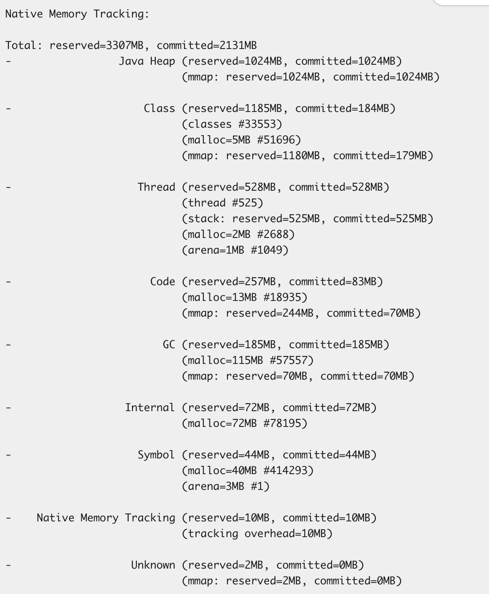

## Native memory tracking (NMT)

Java cung cấp 1 công cụ rất mạnh để theo dõi bộ nhớ của 1 chương trình, giúp lập trình viên có thể truy vết và xử lý các vấn đề liên quan đến vùng nhớ khi phát triển phần mềm.

Khi chạy chương trình Java, chúng ta phải thêm flag `-XX:NativeMemoryTracking=summary` để có thể sử dụng tính năng này, NMT không được sử dụng mặc định bởi vì nó gây thêm một chút gánh nặng cho chương trình chính.

Với PID của process JVM, chúng ta có thể xem tình trạng `các vùng nhớ mà JVM quản lý` bằng lệnh:

```
jcmd <pid> VM.native_memory summary scale=MB
```

<!--  -->

```javascript
Native Memory Tracking:
Total: reserved=1693MB, committed=97MB
       malloc: 25MB #46990
       mmap:   reserved=1667MB, committed=72MB

-                 Java Heap (reserved=256MB, committed=12MB)
                            (mmap: reserved=256MB, committed=12MB)        

-                     Class (reserved=1024MB, committed=1MB)
                            (classes #2491)
                            (  instance classes #2265, array classes #226)
                            (mmap: reserved=1024MB, committed=1MB)        
                            (  Metadata:   )
                            (    reserved=64MB, committed=6MB)
                            (    used=6MB)
                            (    waste=0MB =2.00%)
                            (  Class space:)
                            (    reserved=1024MB, committed=1MB)
                            (    used=1MB)
                            (    waste=0MB =7.77%)

-                    Thread (reserved=24MB, committed=1MB)        
                            (thread #24)
                            (stack: reserved=24MB, committed=1MB) 

-                      Code (reserved=242MB, committed=8MB)       
                            (mmap: reserved=242MB, committed=7MB) 

-                        GC (reserved=62MB, committed=53MB)       
                            (malloc=20MB #709) (peak=20MB #717)   
                            (mmap: reserved=42MB, committed=33MB) 

-                    Symbol (reserved=2MB, committed=2MB)
                            (malloc=2MB #37743) (at peak)

-    Native Memory Tracking (reserved=1MB, committed=1MB)
                            (tracking overhead=1MB)

-        Shared class space (reserved=16MB, committed=12MB)
                            (mmap: reserved=16MB, committed=12MB)

-                 Metaspace (reserved=64MB, committed=6MB)
                            (mmap: reserved=64MB, committed=6MB)
```

Ở bài trước đã đề cập đến 2 khái niệm giá trị vùng nhớ [Reserved/Committed](https://notes-ngtam.pages.dev/posts/jvm-memory-notes), mọi người có thể đọc để hiểu, đây là kiến thức quan trọng khi làm việc với các vấn đề về OOM trong docker/k8s.

Tổng giá trị `committed` từ NMT sẽ đóng góp vào tổng giá trị bộ nhớ vật lý mà container cấp phát cho process, như vậy, giá trị ở mọi người hay xem ở chart Grafana sẽ phải lớn hơn con số này. Ở trong Linux, có thể xài lệnh `ps` để xem RSS của 1 process.

```
ps -o pid,rss,vsz,comm -p <pid>
```

Đây có thể coi là 1 điểm bắt đầu cho lập trình viên bắt đầu các vấn đề liên quan vùng nhớ của một chương trình Java.

## Heap dump


Heap dump ghi nhận các `live objects` trong chương trình, nên giá trị của nó có thể (hầu hết mọi lúc) sẽ nhỏ hơn giá trị `committed` heap từ NMT. 

Những phần vùng nhớ đang không thực sự được sử dụng (có objects trên đó) nhưng vẫn sở hữu của JVM sẽ không được thể hiện (hoặc thể hiện không rõ ràng qua số liệu) làm lập trình viên hiểu nhầm và bối rối. Từ đó dẫn đến một khía cạnh quan trọng trong việc sử dụng bộ nhớ của JVM: `độ hiệu quả của việc trả lại các vùng nhớ không được sử dụng cho OS`. Khía cạnh này trong phạm vi của heap sẽ liên quan đến các `thuật toán GC`, có lẽ mình sẽ tìm hiểu ở bài tiếp theo.
