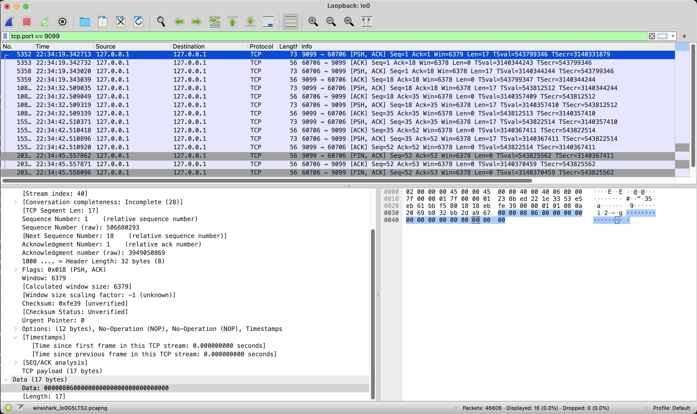

Hello ~,

Tuần rồi trong lúc anh QA thực hiện performance test thì ảnh thấy gRPC client có xuất hiện nhiều log error `connection reset by peer`:

```text
Error call to _: rpc error:
code = Unavailable desc = error reading from server:
read tcp <src>-><dest>: read: connection reset by peer
```

Mô hình triển khai hiện tại là gRPC server sẽ nằm sau một NLB để chia tải. Những lỗi kiểu này muôn thuở sẽ liên quan đến việc TCP connection bị đóng (có thể đúng hoặc không đúng cách) và tầng ứng dụng không phát hiện kịp thời nên vẫn sử dụng các connection này để gửi/nhận dữ liệu.

Để xử lý những vấn đề này thì chắc hẳn mọi người đều nghĩ đến cơ chế `ping-pong` và `retry` rồi, tuy nhiên vì mình muốn tìm hiểu cụ thể vì sao connection bị đóng với mô hình hiện tại, nên có bài viết này :V.

## NLB AWS

Tài liệu chính thức của AWS có đề cập tới cách họ hiện thực [idle timeout](https://docs.aws.amazon.com/elasticloadbalancing/latest/network/network-load-balancers.html#connection-idle-timeout) ở NLB. Sau khi đọc và chạy thử một số trường hợp, mình có rút ra vài ý sau đây:

- NLB hoạt động với keep alive packet của TCP connection, điều này khác với ALB.
- Người dùng không cấu hình được thời gian `idle timeout`.

**-> cập nhật ngày 10/11/2024:** AWS đã bổ sung tính năng điều chỉnh `idle timeout` trên NLB.
> The default idle timeout value for TCP flows is 350 seconds, **but can be updated to any value between 60-6000 seconds**. Clients or targets can use TCP keepalive packets to restart the idle timeout. Keepalive packets sent to maintain TLS connections can't contain data or payload.
- NLB giữ trạng thái của mỗi connection, khi `idle timeout` qua đi, NLB không đóng connection bằng các gói tin `FIN/RST` mà chỉ gửi những gói tin này khi client sử dụng lại connection sau thời gian `idle timeout`.

## gRPC in Linux OS

Mời bạn tham khảo bài viết của [Cloudflare engineer](https://blog.cloudflare.com/when-tcp-sockets-refuse-to-die) để hiểu được chi tiết về các yếu tố ảnh hưởng đến một TCP connection.

- Thông số TCP keep alive

```python
    SO_KEEPALIVE  # enable
    TCP_KEEPIDLE  # idle timeout để TCP stack bắt đầu gửi gói tin keepalive
    TCP_KEEPINTVL # khoảng cách giữa 2 gói tin keepalive
    TCP_KEEPCNT   # số gói tin TCP keepalive tối đa được gửi trước khi connection bị đóng
```

- TCP_USER_TIMEOUT: thời gian tối đa để nhận gói tin `ACK` của một gói tin đã được gửi đi

Khi xem thêm source code của gRPC, mình thấy họ có cấu hình timeout dành cho server:

```go
// After having pinged for keepalive check, the server waits for a duration
// of Timeout and if no activity is seen even after that the connection is
// closed.
Timeout time.Duration // The current default value is 20 seconds.
```

giá trị này có giá trị mặc định là 20 giây được sử dụng để gán cho `TCP_USER_TIMEOUT` khi tạo transport layer:

```
if kp.Time != infinity {
    if err = syscall.SetTCPUserTimeout(rawConn, kp.Timeout); err != nil {
        return nil, connectionErrorf(false, err, "transport: failed to set TCP_USER_TIMEOUT: %v", err)
    }
}
```

Đối với các thông số TCP keep alive, gRPC sử dụng thư viện `net/http` của Go để tạo connection

```go
func newTCPConn(fd *netFD, keepAlive time.Duration, keepAliveHook func(time.Duration)) *TCPConn {
	setNoDelay(fd, true)
	if keepAlive == 0 {
		keepAlive = defaultTCPKeepAlive // 15 seconds
	}
	if keepAlive > 0 {
		setKeepAlive(fd, true)
		setKeepAlivePeriod(fd, keepAlive)
		if keepAliveHook != nil {
			keepAliveHook(keepAlive)
		}
	}
	return &TCPConn{conn{fd}}
}

// hàm này gán cả 2 thông số TCP_KEEPIDLE và TCP_KEEPINTVL với cùng 1 giá trị, mặc định là 15 giây.
func setKeepAlivePeriod(fd *netFD, d time.Duration) error {
	// The kernel expects seconds so round to next highest second.
	secs := int(roundDurationUp(d, time.Second))
	if err := fd.pfd.SetsockoptInt(syscall.IPPROTO_TCP, syscall.TCP_KEEPINTVL, secs); err != nil {
		return wrapSyscallError("setsockopt", err)
	}
	err := fd.pfd.SetsockoptInt(syscall.IPPROTO_TCP, syscall.TCP_KEEPIDLE, secs)
	runtime.KeepAlive(fd)
	return wrapSyscallError("setsockopt", err)
}
```

Như vậy, với giá trị của những thông số mặc định này, nếu không có dữ liệu truyền qua 1 connection trong vòng 15 giây, TCP sẽ bắt đầu gửi keepalive và chỉ cần 2 gói tin keepalive không nhận về gói tin `ACK` thì TCP sẽ đóng connection và gửi gói tin `RST` đến NLB. Đối với trường hợp có 1 số lượng lớn connection thì hiện tượng này cũng có thể xảy ra thường xuyên.

## Giải pháp

gRPC cung cấp cơ chế chủ động `ping-pong`, tầng ứng dụng nên sử dụng các cơ chế chủ động này thay vì phụ thuộc hoàn toàn vào các tầng thấp hơn.

### Server

```go
type ServerParameters struct {

    // After a duration of this time if the server doesn't see any activity it
    // pings the client to see if the transport is still alive.
    // If set below 1s, a minimum value of 1s will be used instead.
    Time time.Duration // The current default value is 2 hours.


    // After having pinged for keepalive check, the server waits for a duration
    // of Timeout and if no activity is seen even after that the connection is
    // closed.
    Timeout time.Duration // The current default value is 20 seconds.
}

// example
var kasp = keepalive.ServerParameters{
    //MaxConnectionIdle:     15 * time.Second, // If a client is idle for 15 seconds, send a GOAWAY
    //MaxConnectionAge:      30 * time.Second, // If any connection is alive for more than 30 seconds, send a GOAWAY
    //MaxConnectionAgeGrace: 5 * time.Second,  // Allow 5 seconds for pending RPCs to complete before forcibly closing connections
    Time:    10 * time.Second, // Ping the client if it is idle for 10 seconds to ensure the connection is still active
    Timeout: 20 * time.Second, // Wait 1 second for the ping ack before assuming the connection is dead
}
```

Mình đã chạy gRPC với cấu hình ví dụ ở trên, sử dụng client để tạo 1 connection tới server và theo dõi qua wireshark, kết quả sau 10 giây thì server sẽ gửi 1 gói tin `ping frame` đến client.



`Ping frame` có độ dài 17 bytes với cấu trúc như hình dưới với các đơn vị trong ngoặc là bit:

```
+--------------------------------------------------------------------+
| Length (24) | Type (8) | Flags (8) | Reserved (1) | Stream ID (31) |
+--------------------------------------------------------------------+
| Opaque Data (64)                                                   |
+--------------------------------------------------------------------+
```

tương ứng với đoạn code sau trong thư viện:

```go
func (f *Framer) WritePing(ack bool, data [8]byte) error {
	var flags Flags
	if ack {
		flags = FlagPingAck
	}
	f.startWrite(FramePing, flags, 0)
	f.writeBytes(data[:])
	return f.endWrite()
}
```

### Client

```go
kaConfig := grpcConfig.GrpcKeepAlive
		
ka := grpc.WithKeepaliveParams(keepalive.ClientParameters{
	Time:                time.Duration(kaConfig.PingInterval) * time.Second,
	Timeout:             time.Duration(kaConfig.PingTimeout) * time.Second,
	PermitWithoutStream: kaConfig.PermitWithoutStream,
})
```

Ở phía client, những thông số này cần được suy nghĩ cẩn thận và phù hợp với phía server, giá trị càng nhỏ thì client sẽ ít gặp lỗi hơn, tuy nhiên việc gửi ping quá nhiều và liên tục cũng gây ảnh hưởng đến server.

## Kết bài

Trong bài này mình đã tóm tắt lại những yếu tố ảnh hưởng đến trạng thái của một TCP connection cũng như cách thư viện gRPC của Go sử dụng để hiện thực protocol, có một vài từ khoá để bạn có thể nghiên cứu sâu thêm:

- TCP keepalive
- TCP user time out
- gRPC ping frame