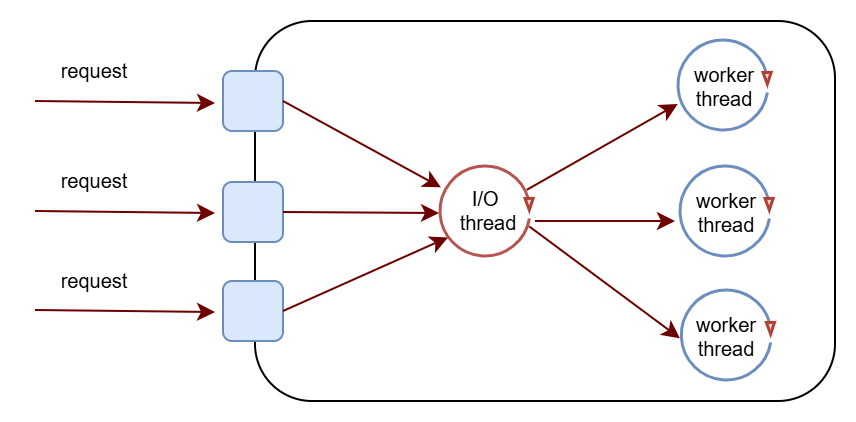
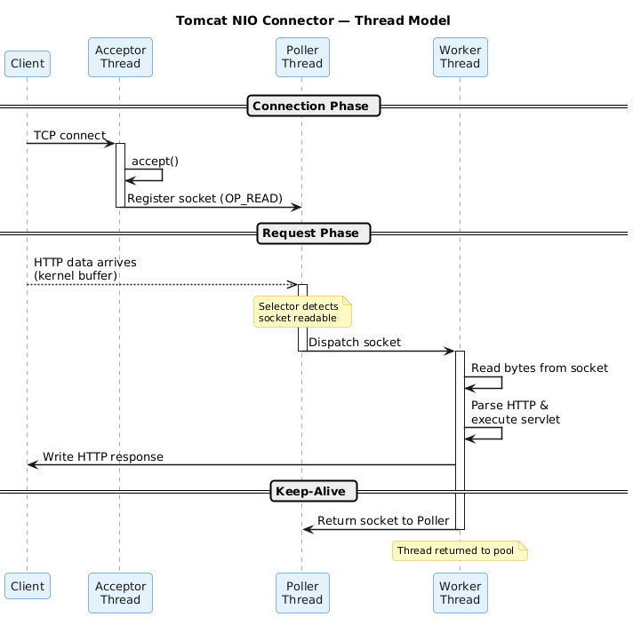
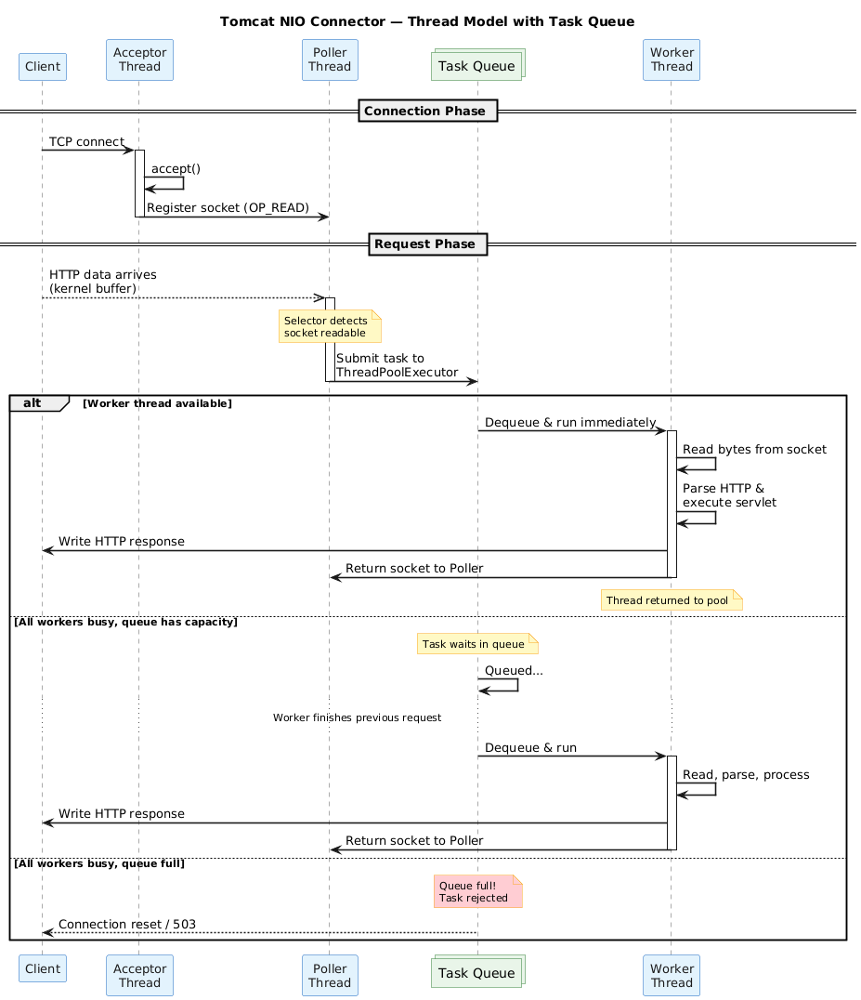
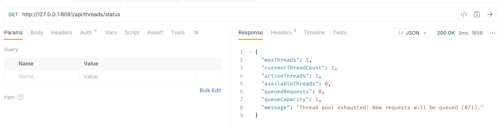
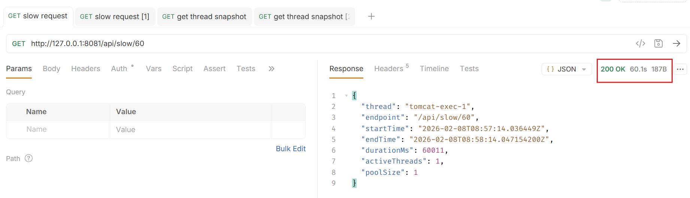
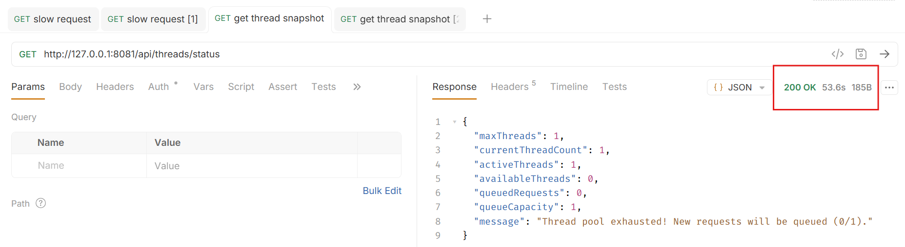
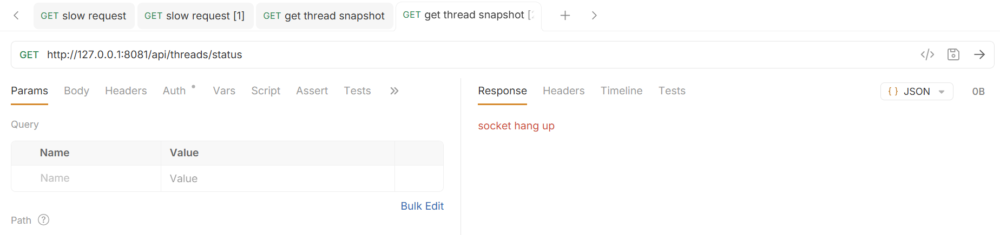

*Bài viết này giải thích mô hình thread / request của một web server, lấy ví dụ trên Apache Tomcat và Spring framework để giải thích cách một web server xử lý request từ phía client.*

<!-- Với sự phát triển của framework Spring, cụ thể là Spring boot, quá trình phát triển một ứng dụng backend ngày càng tiện lợi, tuy nhiên để bước thêm một bước đến mục tiêu tối ưu hiệu năng, làm ứng dụng đáng tin cậy hơn, xử lý các trường hợp  -->

<!-- # Apache Tomcat

Apache Tomcat là một web server và servlet container cho các ứng dụng web được viết bằng Java.
- `web server`: lắng nghe, chờ và chấp nhận các kết nối (connection) từ phía client, trong Tomcat thì phạm vi của web server sẽ nhỏ hơn so với các công cụ khác như Nginx, ví dụ về caching, load balancing, reverse proxy,...
- `servlet container`: servlet là sự kết hợp của server + applet (ứng dụng nhỏ gọn), trong Java web thì nó là các class liên quan đến nhiệm vụ xử lý các request HTTP, ví dụ GET, POST. Khi hiện thực những class này thì cũng cần tuân theo các đặc tả kĩ thuật như Jakarta Servlet 5.0+,...  -->

# Thread per request model

Hiện nay, nhiều web server sử dụng mô hình 1 thread / 1 request để xử lý request từ client.

Có 2 loại thread với chức năng hoàn toàn khác nhau ở mô hình này:
- I/O thread: lắng nghe trên socket và phát hiện dữ liệu đã sẵn sàng để đọc, tạo task để push vào queue mà worker thread đang lắng nghe và xử lý.
	- Tomcat chỉ sử dụng một thread để làm nhiệm vụ này, tham khảo bài viết [network-io-multiplexing](https://notes-ngtam.pages.dev/posts/network-io-multiplexing) về kĩ thuật epoll để hiểu thêm cách thức hoạt động ở tầng hệ điều hành. 
- Worker thread: mỗi khi có task từ queue thì lấy ra để đọc nội dung request từ socket, xử lý logic (validate dữ liệu, tính toán, truy vấn database, gọi đi các service khác,...) và ghi response vào socket lại.

Có một điểm cần chú ý ở đây là thuật ngữ request sẽ khác với connection, request là các yêu cầu HTTP GET/POST/PUST,... còn connection là TCP connection.

Hình sau mô tả chi tiết hơn các thành phần trong quá trình xử lý một connection và request.

***Một số phân tích về ưu nhược điểm***

Với việc sử dụng riêng một thread để phát hiện khi nào có request sẵn sàng, server sẽ không bị chiếm dụng tài nguyên cho các long-live connection, tức là client có thể mở một TCP connection và gửi nhiều request HTTP trên đó, worker thread chỉ được sử dụng thực sự khi có request.

Mô hình này còn cho phép debug lỗi dễ dàng ở tầng ứng dụng, mỗi request sẽ được xử lý bởi một worker thread, các thông tin về request context sẽ không bị nhầm lẫn, và có thể xem được đầy đủ stacktrace khi có lỗi xảy ra.

Bên cạnh các ưu điểm, mặt tài nguyên của hệ thống cần được phân tích kĩ lưỡng khi sử dụng model này, nếu ở tầng ứng dụng sử dụng các thao tác blocking như kiểm tra dữ liệu, truy vấn database, gọi các service bên thứ 3, thì worker thread sẽ bị chiếm dụng trên toàn bộ thời gian này, có nghĩa là số request tối đa được xử lý tại một thời điểm sẽ bằng số lượng worker thread *tối đa*. Tối đa là bao nhiêu???

Về lý thuyết, một chương trình có thể tạo ra số lượng threads không giới hạn, nhưng quản lý threads tiêu tốn tài nguyên và nhiều threads dẫn tới context-switch của CPU cao, nếu không cấu hình giới hạn, chương trình có thể bị OOM, rất rủi ro.

Nếu có cấu hình, con số bao nhiêu là đủ? Tuỳ thuộc vào workload và kết quả benchmark, tất nhiên rồi. Tuy nhiên cần làm rõ thêm hành vi của request một khi không còn worker rảnh rỗi.

# Demo

Github link: [thread-per-request](https://github.com/dntam00/spring-fw-learning/tree/master/thread-per-request)

Chuơng trình này tạo 1 web server đơn giản Spring và embedded Tomcat:
- Cấu hình số worker thread và task queue nhỏ.
	- `server.tomcat.threads.max=1`: cấu hình worker threads size.
	- `server.tomcat.task-queue-capacity=1`: cấu hình task queue size.
- Mô phỏng thời gian xử lý business bằng việc sleep worker thread.
- Cung cấp api để lấy thống kê số lượng threads hiện tại.

Hình sau thêm thành phần task queue vào giữa I/O thread và worker thread, khi worker thread pool không còn thread nào rảnh rỗi, những request mới sẽ được thêm vào queue chờ xử lý. Nếu worker thread mất quá nhiều thời gian để xử lý những request, client có thể gặp hiện tượng timeout với các giai đoạn:
- request đang nằm trong task queue, chưa được xử lý bởi worker thread.
- request được xử lý bởi worker thread nhưng không thể trả về response.
- tệ hơn nữa, request đang được xử lý thì chương trình bị OOM.

Với `worker thread size = 1`, api lấy thống kê threads trả về như sau:

- cần 1 worker thread để xử lý request lấy thống kê threads.
- vì cấu hình worker chỉ có 1 thread nên số thread còn lại đang khả dụng sẽ bằng 0.

Tiếp tục mô phỏng kiểm tra cách hoạt động của mô hình này bằng request cần thời gian xử lý lâu.
- gọi 1 API mô phỏng request cần 1 phút để xử lý.
- gọi 2 API lấy thống kê threads liên tiếp.

Với `worker thread size = 1`, `queue size = 1` thì request thứ 3 sẽ bị reject, request thứ 2 sẽ phải chờ request thứ nhất xử lý xong.

Request thứ nhất cần 60s.

Request thứ hai được đưa vào queue và chỉ được xử lý sau request thứ nhất.

Request thứ ba bị từ chối vì task queue đã đầy.

# Tổng kết
Bài viết đã trình bày mô hình `thread per request` của các web server và lấy ví dụ bằng Tomcat + Spring. Việc hiểu rõ mô hình này là một bước quan trọng trong việc hiểu rõ chương trình, là nền tảng cho các công việc benchmark, tối ưu hiệu năng.