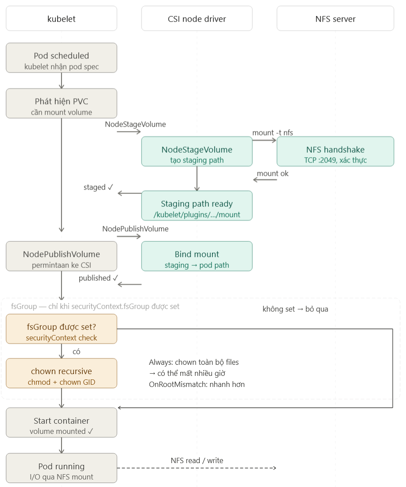

## Tuần 20 / 2026

***Trển khai (rollout deployment) cho nhiều service mất nhiều thời gian một cách bất thường.***

Ngữ cảnh: Thay đổi cấu hình và triển khai nhiều service một lần, nhiều pods của các service này sử dụng một storage chung (NFS) thông qua 1 PVC/PV. Quá trình này mất thời gian một cách rất bất thường, về ngủ 1 đêm hôm sau lên thì thấy ok :)).
- ~ 37 pods bị kẹt ở trạng thái `ContainerCreating` trên nhiều worker node.
- 3 pods bị kẹt ở trạng thái `Terminating`.
- Các pod bị kẹt có lỗi `kubelet - unable to attach or mount volumes`.
- Log của NFS CSI driver chạy trên từng worker node (daemonset) không có gì bất thường, hoàn toàn là log info thành công.

Các thông tin trên đều được thu thập bằng công cụ `kubectl`, truy cập từ bên ngoài k8s cluster, chỉ có một điểm bất thường là log lỗi `unable to attach or mount volumes` từ `kubelet` chạy trong các worker node, như vậy cần truy cập worker node để xem log của kubelet bằng systemd của Linux (k8s cluster này team đang quản lý hơi thủ công quá :)), đẹp hơn thì cần có log agent để thu thập và đẩy ra hệ thống khác để index và query).

```
E0510 11.07.33.180515 ... lchown ... mount/e7/3070: operation not permitted
E0510 11.07.33.180515 ... lchown ... mount/e7/4b83: operation not permitted
```

Đếm qua thì thấy có hơn 3 triệu dòng log kiểu này, chứng tỏ kubelet đang bị làm một hành động nhiều lần và bị lỗi, có vẻ quá trình này là quá trình blocking nên kubelet không có thời gian làm gì khác.

Đến đây thì cũng hòm hòm được nguyên nhân các pod bị kẹt ở một trạng thái rồi, tiếp theo là sử dụng ChatGPT, Gemini, Claude Chat để hiểu được toàn bộ luồng tổng quát của việc triển khai 1 pod cần mount NFS với các thông số cấu hình của dự án hiện tại.



Vì có `fsGroup` trong phần cấu hình của k8s, kubelet cần chạy lệnh `chown` trên tất cả các folder/file trên NFS server thuộc mount path để lấy quyền về cho pod này, quá trình này cần chạy xong (theo phong cách đồng bộ (synchronous)), có hết kết quả thì kubelet mới gọi CRI để chạy container được, mục đích là để đảm bảo khi pod chạy lên sẽ sử dụng được filesystem trên NFS ngay. Do đó, thông tin này giải đáp được vấn đề có nhiều pod bị kẹt ở 1 trạng thái rất lâu.

Tiếp theo, thông tin `lchown ... mount/e7/3070: operation not permitted` cho thấy kubelet không lấy quyền trên folder/file của NFS được, tuy nhiên sau khi thử trên tất cả các files thì pod vẫn chạy được, vẫn ghi/đọc trên NFS được, chứng tỏ việc sử dụng cấu hình `fsGroup` là vô nghĩa, mà còn tốn thêm một đống tài nguyên và thời gian để chờ triển khai 😑. Nguyên nhân của việc này là do bên team infra muốn an toàn, họ cung cấp NFS mount với chế độ `root squash`, vai trò root của client sẽ được chuyển thành nobody/nogroup khi đọc/ghi file trên NFS, tránh việc client có quyền root trên NFS server.

Để an tâm hơn thì mình đã dựng một NFS server trên k8s cluster local để kiểm thử, và hoàn toàn xác thực các lý do trên.

Lúc nãy sẽ có 2 mức độ giải quyết:
- Nhanh: không sử dụng `fsGroup` nữa, vẫn giữ quyền root cho các pod.  
- Tốt: nghiên cứu không sử dụng quyền root khi triển khai, migrate các file trên NFS sang quyền sở hữu của user khác.

Qua việc này, lại một lần nữa thấm thía việc hiểu hệ thống, flow tương tác giữa các thành phần của hệ thống trong việc xử lý lỗi.
- Giảm thời gian xác định nguồn gốc lỗi, từ ngày có AI, việc hiểu các hệ thống không phải mình phát triển (các opensource) đã dễ thở hơn rất nhiều.
- Luôn luôn tự kiểm tra cặn kẽ vấn đề nếu thấy có điều bất thường, hoặc giải thích hoặc xử lý nó. Cách nghĩ này mình cũng đã nghe từ một anh đồng nghiệp mình rất ngưỡng mộ, hôm đi nhậu chia tay tiễn ảnh ra Thủ Đô (nói đến đây lại nhớ ông anh và thời gian làm việc chung với ổng quá :)) ).


## Tuần 21 / 2026

***Một vài vấn đề / công cụ cần quan tâm khi thực hiện migrate hệ thống***

- Dựa vào compiler để kiểm tra lỗi cú pháp, dựa vào testcase để kiểm tra nghiệp vụ, nếu có thời gian hãy hiểu hệ thống về cả mặt kĩ thuật, nghiệp vụ thật kĩ.
- Dựa vào các công cụ quản lý phụ thuộc để kiểm tra việc xóa code cũ đã hoàn thành hay chưa, xóa một module cũ đi mà hệ thống build lỗi thì code vẫn chưa được xóa hết.
- Khi triển khai, phải làm rõ được công việc này ảnh hưởng đến các bên đang sử dụng hệ thống như thế nào, có tương thích ngược hay không (backward-compatible).
- Nếu migrate database, cần xác định được mức độ ảnh hưởng nếu xảy ra gián đoạn.
- Khi export/import database, cần kiểm tra tính toàn vẹn dữ liệu.
- Cần chuẩn bị các kịch bản để có thể rollback hệ thống nếu xảy ra sự cố.
- Cần chuẩn bị các kịch bản kiểm thử, checklist hoàn thành công việc.